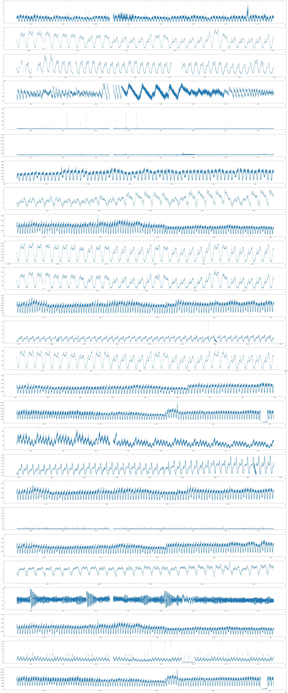

# Report

Sep 29th-He Zhuokun

### 1. Classification of KPI ID

I group the whole data set by KPI ID and get the visualized result as follow.

Though there are 26 categories of KPI ID in all according to data, 4 or 5 categories may be better for future study.

### 2. Completion of missing value

After classifying the data based on KPI ID, I choose several samples to complete the missing value by generating the new periodical series and such exploration is still ongoing.

### 3. Further work

- Feature extraction
- Model training