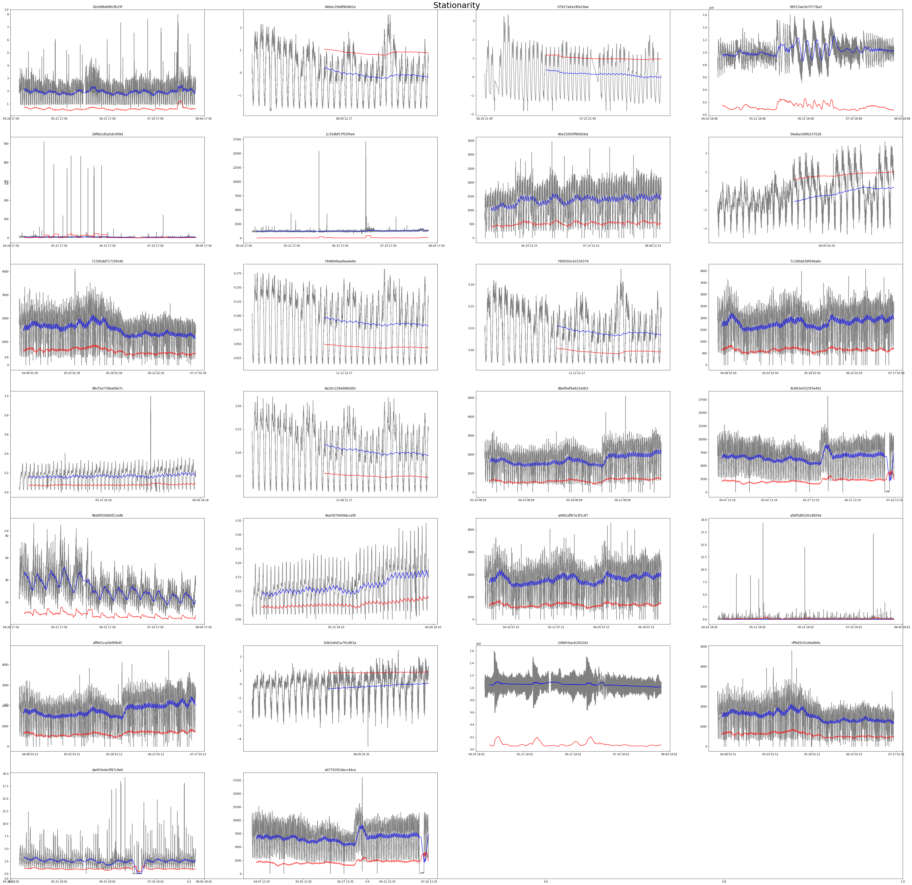

# Report

Oct 13th He Zhuokun

### 1. Stationarity of the Time Series

After grouping the data by KPI ID, I check the stationary of each group.

<table border="1" class="dataframe">
  <thead>
    <tr style="text-align: right;">
      <th></th>
      <th>KPI ID</th>
      <th>Number of Observations Used</th>
      <th>Lags Used</th>
      <th>Test Statistic</th>
      <th>p-value</th>
      <th>Critical Value (1%)</th>
      <th>Critical Value (5%)</th>
      <th>Critical Value (10%)</th>
    </tr>
  </thead>
  <tbody>
    <tr>
      <th>0</th>
      <td>02e99bd4f6cfb33f</td>
      <td>128489.0</td>
      <td>72.0</td>
      <td>-11.5206</td>
      <td>4.04901e-21</td>
      <td>-3.430401</td>
      <td>-2.861562</td>
      <td>-2.566782</td>
    </tr>
    <tr>
      <th>1</th>
      <td>046ec29ddf80d62e</td>
      <td>8746.0</td>
      <td>37.0</td>
      <td>-12.2679</td>
      <td>8.77409e-23</td>
      <td>-3.431098</td>
      <td>-2.861871</td>
      <td>-2.566946</td>
    </tr>
    <tr>
      <th>2</th>
      <td>07927a9a18fa19ae</td>
      <td>10934.0</td>
      <td>25.0</td>
      <td>-9.66462</td>
      <td>1.3254e-16</td>
      <td>-3.430948</td>
      <td>-2.861804</td>
      <td>-2.566911</td>
    </tr>
    <tr>
      <th>3</th>
      <td>09513ae3e75778a3</td>
      <td>128902.0</td>
      <td>68.0</td>
      <td>-10.6747</td>
      <td>4.08161e-19</td>
      <td>-3.430401</td>
      <td>-2.861562</td>
      <td>-2.566782</td>
    </tr>
    <tr>
      <th>4</th>
      <td>18fbb1d5a5dc099d</td>
      <td>129058.0</td>
      <td>69.0</td>
      <td>-33.0487</td>
      <td>0</td>
      <td>-3.430401</td>
      <td>-2.861562</td>
      <td>-2.566782</td>
    </tr>
    <tr>
      <th>5</th>
      <td>1c35dbf57f55f5e4</td>
      <td>128786.0</td>
      <td>66.0</td>
      <td>-12.8265</td>
      <td>5.99682e-24</td>
      <td>-3.430401</td>
      <td>-2.861562</td>
      <td>-2.566782</td>
    </tr>
    <tr>
      <th>6</th>
      <td>40e25005ff8992bd</td>
      <td>100185.0</td>
      <td>68.0</td>
      <td>-17.7396</td>
      <td>3.40674e-30</td>
      <td>-3.430415</td>
      <td>-2.861569</td>
      <td>-2.566785</td>
    </tr>
    <tr>
      <th>7</th>
      <td>54e8a140f6237526</td>
      <td>8211.0</td>
      <td>36.0</td>
      <td>-8.22626</td>
      <td>6.23478e-13</td>
      <td>-3.431147</td>
      <td>-2.861892</td>
      <td>-2.566957</td>
    </tr>
    <tr>
      <th>8</th>
      <td>71595dd7171f4540</td>
      <td>147593.0</td>
      <td>74.0</td>
      <td>-22.0551</td>
      <td>0</td>
      <td>-3.430394</td>
      <td>-2.861560</td>
      <td>-2.566780</td>
    </tr>
    <tr>
      <th>9</th>
      <td>769894baefea4e9e</td>
      <td>8755.0</td>
      <td>28.0</td>
      <td>-13.9927</td>
      <td>3.99061e-26</td>
      <td>-3.431097</td>
      <td>-2.861870</td>
      <td>-2.566946</td>
    </tr>
    <tr>
      <th>10</th>
      <td>76f4550c43334374</td>
      <td>8747.0</td>
      <td>36.0</td>
      <td>-12.3013</td>
      <td>7.44063e-23</td>
      <td>-3.431098</td>
      <td>-2.861870</td>
      <td>-2.566946</td>
    </tr>
    <tr>
      <th>11</th>
      <td>7c189dd36f048a6c</td>
      <td>147613.0</td>
      <td>75.0</td>
      <td>-24.8656</td>
      <td>0</td>
      <td>-3.430394</td>
      <td>-2.861560</td>
      <td>-2.566780</td>
    </tr>
    <tr>
      <th>12</th>
      <td>88cf3a776ba00e7c</td>
      <td>65375.0</td>
      <td>60.0</td>
      <td>-11.8804</td>
      <td>6.19783e-22</td>
      <td>-3.430450</td>
      <td>-2.861584</td>
      <td>-2.566794</td>
    </tr>
    <tr>
      <th>13</th>
      <td>8a20c229e9860d0c</td>
      <td>8746.0</td>
      <td>37.0</td>
      <td>-13.2783</td>
      <td>7.78495e-25</td>
      <td>-3.431098</td>
      <td>-2.861871</td>
      <td>-2.566946</td>
    </tr>
    <tr>
      <th>14</th>
      <td>8bef9af9a922e0b3</td>
      <td>129380.0</td>
      <td>72.0</td>
      <td>-22.4956</td>
      <td>0</td>
      <td>-3.430401</td>
      <td>-2.861562</td>
      <td>-2.566782</td>
    </tr>
    <tr>
      <th>15</th>
      <td>8c892e5525f3e491</td>
      <td>146935.0</td>
      <td>73.0</td>
      <td>-22.7185</td>
      <td>0</td>
      <td>-3.430395</td>
      <td>-2.861560</td>
      <td>-2.566780</td>
    </tr>
    <tr>
      <th>16</th>
      <td>9bd90500bfd11edb</td>
      <td>128540.0</td>
      <td>72.0</td>
      <td>-9.0015</td>
      <td>6.47887e-15</td>
      <td>-3.430401</td>
      <td>-2.861562</td>
      <td>-2.566782</td>
    </tr>
    <tr>
      <th>17</th>
      <td>9ee5879409dccef9</td>
      <td>65387.0</td>
      <td>61.0</td>
      <td>-14.4262</td>
      <td>7.7647e-27</td>
      <td>-3.430450</td>
      <td>-2.861584</td>
      <td>-2.566794</td>
    </tr>
    <tr>
      <th>18</th>
      <td>a40b1df87e3f1c87</td>
      <td>137850.0</td>
      <td>74.0</td>
      <td>-23.697</td>
      <td>0</td>
      <td>-3.430397</td>
      <td>-2.861561</td>
      <td>-2.566781</td>
    </tr>
    <tr>
      <th>19</th>
      <td>a5bf5d65261d859a</td>
      <td>128660.0</td>
      <td>18.0</td>
      <td>-74.2673</td>
      <td>0</td>
      <td>-3.430401</td>
      <td>-2.861562</td>
      <td>-2.566782</td>
    </tr>
    <tr>
      <th>20</th>
      <td>affb01ca2b4f0b45</td>
      <td>147604.0</td>
      <td>75.0</td>
      <td>-25.2284</td>
      <td>0</td>
      <td>-3.430394</td>
      <td>-2.861560</td>
      <td>-2.566780</td>
    </tr>
    <tr>
      <th>21</th>
      <td>b3b2e6d1a791d63a</td>
      <td>8211.0</td>
      <td>35.0</td>
      <td>-12.2695</td>
      <td>8.70614e-23</td>
      <td>-3.431147</td>
      <td>-2.861892</td>
      <td>-2.566957</td>
    </tr>
    <tr>
      <th>22</th>
      <td>c58bfcbacb2822d1</td>
      <td>128594.0</td>
      <td>72.0</td>
      <td>-37.3401</td>
      <td>0</td>
      <td>-3.430401</td>
      <td>-2.861562</td>
      <td>-2.566782</td>
    </tr>
    <tr>
      <th>23</th>
      <td>cff6d3c01e6a6bfa</td>
      <td>147553.0</td>
      <td>75.0</td>
      <td>-21.9011</td>
      <td>0</td>
      <td>-3.430394</td>
      <td>-2.861560</td>
      <td>-2.566780</td>
    </tr>
    <tr>
      <th>24</th>
      <td>da403e4e3f87c9e0</td>
      <td>128977.0</td>
      <td>57.0</td>
      <td>-9.05977</td>
      <td>4.59681e-15</td>
      <td>-3.430401</td>
      <td>-2.861562</td>
      <td>-2.566782</td>
    </tr>
    <tr>
      <th>25</th>
      <td>e0770391decc44ce</td>
      <td>146948.0</td>
      <td>75.0</td>
      <td>-22.4657</td>
      <td>0</td>
      <td>-3.430395</td>
      <td>-2.861560</td>
      <td>-2.566780</td>
    </tr>
  </tbody>
</table>

The red line is rolling std and the blue line is rolling mean.

According to the result, we can tell that the groups above are all stationary and this is the foundations of the following work like using ARMA model.

### 2. Extract MA feature

I choose group '40e25005ff8992bd' as the sample to extract MA features and extract another version after imputing the missing values with the mean values.

BiLSTM model is still at the stage of modification.