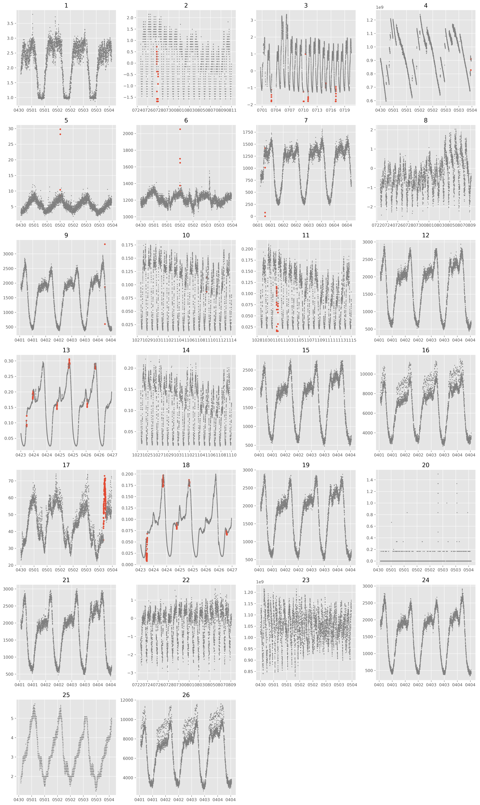
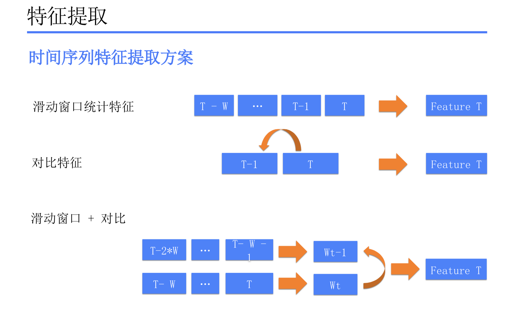
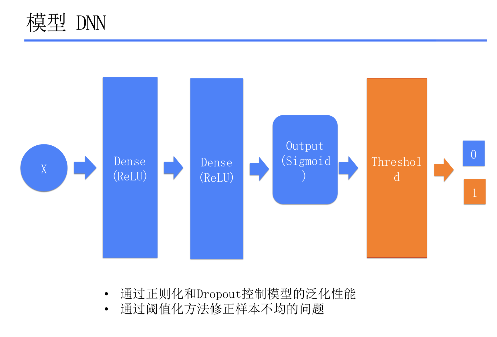
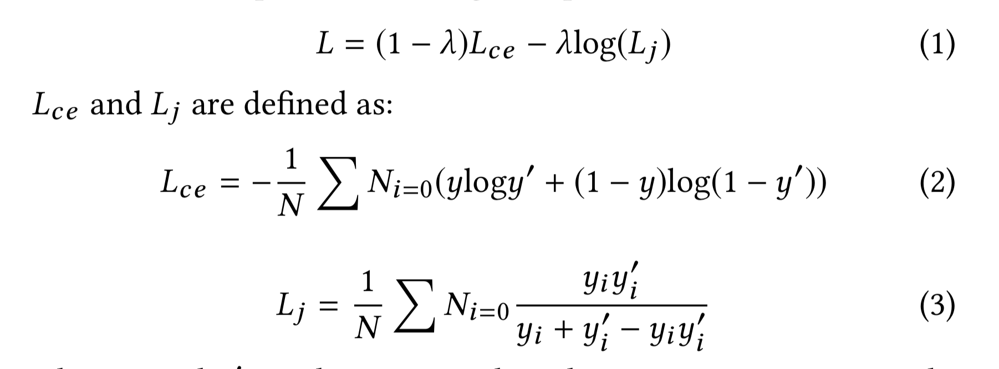

# A First Glance of AIOps 
Sept.29 - Tao Sun (1652175)

## Data Description

### AIOps Data

AIOps provides a KPI dataset collected from a few IT companies. It contains KPI time-serise records of 26 different categories, whose properties are of variant. Each data point has 4 attributes: timestamp, value, label (normal or abnormal) and its category. 

Firstly, I have drawn 26 scatter plots for each category's first 5000 points (to make it clearier) respectively (Fig 1). Red point denotes the abnormal  KPI value, while gray means the normal. 



We could find several interting things:

- The sampling frequency varies from category to category. Some categories have more than 1000 points a day, but others may only have nearly 100.
- The occurrence frequency of anormal points also varies.
- Almost all the data change in a periodical pattern significantly.

### Statics of Data

A more quantitative result is shown in the table below. The abnormal ratio is small in many categories, such as 0.05% (Category. 7) and 0.10% (Category. 9). That means the provides data are strongly uneven, which we should overcome.

|No. | Category | Total Points | Abnormal Points (ratio %) | Start Time | End Time | TIme Duration | Sample Freq (point/day)|
|:-- | :-: | :-: | :-: | :-: | :-: | :-:|:-: |
| 0 | 02e99bd4f6cfb33f | 128562 | 10550 (8.21%)| 2017-04-30 16:00:00 | 2017-07-31 04:34:00 | 91 days  | 1412.77 |
| 1 | 046ec29ddf80d62e | 8784 | 80  (0.91%) | 2016-07-24 16:00:00 | 2016-08-24 03:55:00 | 30 days  | 292.80 |
| 2 | 07927a9a18fa19ae | 10960 | 130 (1.19%)| 2016-06-30 16:00:00 | 2016-08-12 08:30:00 | 42 days  | 260.95 |
| 3 | 09513ae3e75778a3 | 128971 | 238 (0.18%)| 2017-04-30 16:00:00 | 2017-07-31 04:24:00 | 91 days  | 1417.26 |
| 4 | 18fbb1d5a5dc099d | 129128 | 7863 (6.09%)| 2017-04-30 16:00:00 | 2017-07-31 04:34:00 | 91 days  | 1418.99 |
| 5 | 1c35dbf57f55f5e4 | 128853 | 9581 (7.44%)| 2017-04-30 16:00:00 | 2017-07-31 04:34:00 | 91 days  | 1415.97 |
| 6 | 40e25005ff8992bd | 100254 | 654 (0.65%)| 2017-06-01 03:36:00 | 2017-08-11 10:20:00 | 71 days  | 1412.03 |
| 7 | 54e8a140f6237526 | 8248 | 4    (0.05%) | 2016-07-22 16:00:00 | 2016-08-20 11:45:00 | 28 days  | 294.57 |
| 8 | 71595dd7171f4540 | 147668 | 1113 (0.75%)| 2017-04-01 10:08:00 | 2017-07-15 07:56:00 | 104 days | 1419.88 |
| 9 | 769894baefea4e9e | 8784 | 9 (0.10%)| 2016-10-27 16:00:00 | 2016-11-27 03:55:00 | 30 days  | 292.80 |
| 10 | 76f4550c43334374 | 8784 | 87 (0.99%)| 2016-10-28 16:00:00 | 2016-11-28 03:55:00 | 30 days  | 292.80 |
| 11 | 7c189dd36f048a6c | 147689 | 426 (0.29%)| 2017-04-01 10:08:00 | 2017-07-15 07:47:00 | 104 days | 1420.09 |
| 12 | 88cf3a776ba00e7c | 65436 | 3106 (4.75%)| 2017-04-23 17:09:00 | 2017-06-08 04:19:00 | 45 days  | 1454.13 |
| 13 | 8a20c229e9860d0c | 8784 | 4 (0.05%)| 2016-10-23 16:00:00 | 2016-11-23 03:55:00 | 30 days  | 292.80 |
| 14 | 8bef9af9a922e0b3 | 129453 | 527 (0.41%)| 2017-04-01 10:08:00 | 2017-07-02 02:07:00 | 91 days  | 1422.56 |
| 15 | 8c892e5525f3e491 | 147009 | 3083 (2.10%)| 2017-04-01 10:08:00 | 2017-07-15 19:32:00 | 105 days | 1400.09 |
| 16 | 9bd90500bfd11edb | 128613 | 143 (0.11%)| 2017-04-30 16:00:00 | 2017-07-31 04:34:00 | 91 days  | 1413.33 |
| 17 | 9ee5879409dccef9 | 65449 | 2945 (4.50%)| 2017-04-23 17:09:00 | 2017-06-08 04:26:00 | 45 days  | 1454.42 |
| 18 | a40b1df87e3f1c87 | 137925 | 381 (0.28%)| 2017-04-01 10:08:00 | 2017-07-08 04:59:00 | 97 days  | 1421.91 |
| 19 | a5bf5d65261d859a | 128679 | 29 (0.02%)| 2017-04-30 16:00:00 | 2017-07-31 04:29:00 | 91 days  | 1414.05 |
| 20 | affb01ca2b4f0b45 | 147680 | 584 (0.40%)| 2017-04-01 10:08:00 | 2017-07-15 07:28:00 | 104 days | 1420.00 |
| 21 | b3b2e6d1a791d63a | 8247 | 12 (0.15%)| 2016-07-22 16:00:00 | 2016-08-20 11:40:00 | 28 days  | 294.54 |
| 22 | c58bfcbacb2822d1 | 128667 | 124 (0.10%)| 2017-04-30 16:00:00 | 2017-07-31 04:29:00 | 91 days  | 1413.92 |
| 23 | cff6d3c01e6a6bfa | 147629 | 1087 (0.74%)| 2017-04-01 10:08:00 | 2017-07-15 08:38:00 | 104 days | 1419.51 |
| 24 | da403e4e3f87c9e0 | 129035 | 7666 (5.94%)| 2017-04-30 16:00:00 | 2017-07-31 04:29:00 | 91 days  | 1417.97 |
| 25 | e0770391decc44ce | 147024 | 3074 (2.09%)| 2017-04-01 10:08:00 | 2017-07-15 19:18:00 | 105 days | 1400.23 |

  

## Experiments

To get a better understanding of AIOps contest, I am now trying to reproduce the contest champion's solution.

### Feature Engineering

According to the solution, I extracted feature of 3 classes: 

- Statics feature (mean, standard varience)

- Contrast feature (sequence difference, ratio)

- Statics feature and contrast feature under moving window .

  Number of features   $N*(2 + 2 *2)=6N$  , here N is the number of different windows.



The window length series  is set to [1, 2, 3, 4, 5, 6, 7, 8, 9, 10, 20, 30, 40, 50, 100]. Therefore, the total feature of each point is $6*15=90$. This is just a simple attempt of the solution, so all these feature enginering methods should be improved in the feature.

### Dense Neural  Network (DNN) model

A network is implemented based on the solution's proposed network. More detailed parameters are shown in the list below. For a simple experiment, I didn't spend too much time on turning hyper-parameters. I set the dropout rate to 50% and the initial learning rate to 0.01. An Adam optimizer is used to train this network.



```
_________________________________________________________________
Layer (type)                 Output Shape              Param #   
=================================================================
dense_34 (Dense)             (None, 128)               11776     
_________________________________________________________________
dropout_23 (Dropout)         (None, 128)               0         
_________________________________________________________________
dense_35 (Dense)             (None, 256)               33024     
_________________________________________________________________
dropout_24 (Dropout)         (None, 256)               0         
_________________________________________________________________
dense_36 (Dense)             (None, 1)                 257       
=================================================================
Total params: 45,057
Trainable params: 45,057
Non-trainable params: 0
_________________________________________________________________
```

For the loss function, I try to use the normal cross-entropy loss at first. However, under the impact of the strong uneven distribution, cross-entropy loss can not converge well. Hense, I replace it with the Jaccard loss, which proved to be more torelence at this situation [1].

The total loss $L$ is defined as:




### Results

Only one category (category 12, which have a average amount of points) is used in this test. The first 80% of the data are for training data and the remaning are for validation.

| Metrics (%) | Accurancy | Recall | Precision | F1 Score |
| ----------- | --------- | ------ | --------- | -------- |
| Training    | 99.12     | 43.07  | 78.35     | 53.46    |
| Validation  | 98.83     | 49.13  | 56.48     | 51.72    |

From the result, we can see that my model can detect about 50% abnormal points. It F1 score on the validation set reaches 51.72%. But the perfoemance is still inferior to the champoin's. The feature engineering method and the model structure both need futher working.

## Reference
[1] Maxim Berman, Amal Rannen Triki, and Matthew B Blaschko. The Lovasz-Softmax loss: A tractable surrogate for the optimization of the intersection-over-union measure in neural networks. arXiv.org, May 2017.

