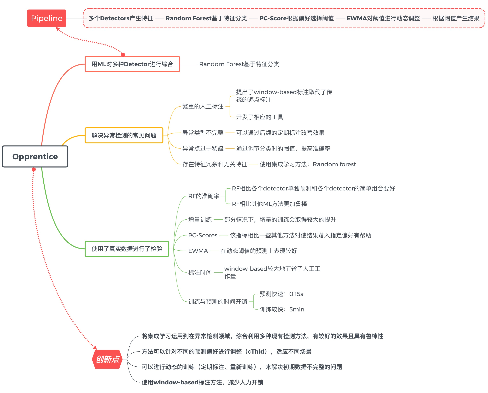

# Report3: Paper Reading

孙韬 1652175

## Opprentice: Towards Practical and Automatic Anomaly Detection Through Machine Learning

### Summary

本文中，作者提出了一种可以减少标注工作量的基于机器学习的异常检测算法。该算法集成了一些传统的异常检测器（detector）来产生特征，随机森林（random forest）算法基于这些特征进行异常检测。为了适应不同的性能偏好（perference），作者设提出了一个基于PC-Score的阈值选择方法，和基于EWMA的动态阈值调整方法。最后，作者用真实数据验证了上述方法。

### Contribution

文章的贡献主要是以下几点：

- 首先提出了用机器学习的方法对多种detector进行综合
- 解决了异常检测中常见的问题，包括过于繁重的标注工作、异常类型不完整、类间的不平衡（异常点过于稀疏）和潜在冗余或无关的特征
- 用真实数据进行了检验，包括：PV、SR、SRT。

### Comments

文章提出了一个新颖、完整的异常检测流程。针对智能异常检测中的常见问题，比如人工标注工作量过大、初期数据中异常类型不完整、异常检测的偏好（recall和precision间的trade-off）不同、异常样本点非常稀疏等，本方法都提出了相应的解决方法，并通过实验证明了其有效性。总体而言，本文提出的方法是具有说服力的。在论述上，作者详细地讨论了异常检测目前的挑战，并设计了相应的方法进行解决。逻辑清晰，易于阅读。虽然本文使用的方法基本是常见的算法的组合，但将它们融合并形成一个完整、有效的异常检测流程仍然是非常具有挑战的。

本文最大的创新点是首先将ML中的集成学习运用到在异常检测领域，并取得了较好的结果。该方法是基于多种传统的检测器的综合（比如简单的阈值、差分、移动平均MA、时间序列分解ARIMA等），利用Random forest根据一定量的训练数据自动学习这些特征的规律，并最终作出预测。通过完整的实验，作者首先证明了：

1. 多个Detectors通过RF的集成比单个Detector好
2. 多个Detectors通过RF的集成比多个Detector简单综合好（简单综合指多数投票法等）
3. 多个Detectors通过RF的集成比使用其他机器学习方法好

这一组实验验证了Random forest算法的有效性。

之外，作者还提出了使用“定期标注”的方法，解决初期数据中异常类型不完整的问题；用PC-Socre的方法选择最佳阈值，使得预测能满足不同偏好；使用EWMA对最佳阈值的变化规律进行预测，使得模型能适应随季节性变化的异常场景。这些也进行了大量的实验加以确认。

### Questions

虽然文章总体上论述完备，但仍有几个问题可以进行探讨：

1. 论文多次写到“只需要定期的人工标注来矫正预测结果”（P1、P2、P4、P5），但实验部分并没有对如何“定期标注”以及“定期标注”对预测结果的影响进行定量实验。实验5.7仅说明了使用window-based标注工具进行标注比传统的逐点标注明显减少了工作量，实验5.4仅说明了进行一次增量训练的结果提升。这些不能说明后续“定期标注”的需要多少次数、按照说明频率。如果后续需要反复、大量地进行标注，个人认为该方法的价值会降低。
2. 作者提出用EWMA进行最佳阈值（cThld）的预测（P7），因为Fig.7的结果表明不同时间段内最佳阈值的波动是比较大的，不同KPI数据的最佳阈值也有很大差异。但，我们注意到Random forest在训练时的阈值是按照定值0.5来设定的，理想情况下预测时候最佳的阈值也应该是0.5。现在最佳阈值波动较大，从另一个角度说明模型其实没有很好的解决数据随季节变化较大的问题。虽然实验5.6证明了EWMA对阈值有一定的预测准确率，但如果由Random forest去学习这个波动规律是一个更加合理的做法，因为这样利于进行End-to-end的训练与调试。
3. 作者使用了14个现有的detector进行特征提取，大部分detector都需要设置参数。为了减少手工调参，作者提出了参数采样的想法（sampling parameters）（P5、P8）。虽然在实验5.3.2中证明了随机森林对与特征的数量具有较好的鲁棒性，但参数的选取对最终结果的影响还是需要一定的讨论。

z

