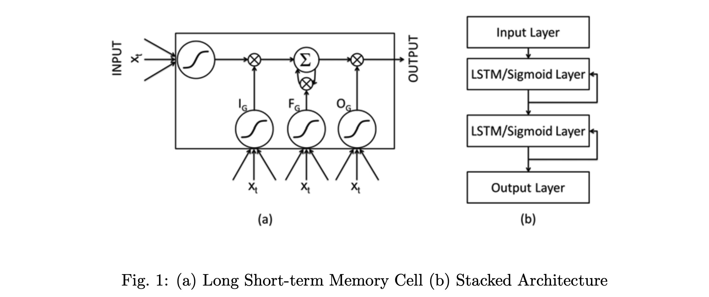

# Report4: Paper Reading

孙韬 - 1652175

## Anomaly detection for time-series data

The methods of anomaly detection can be divided into 2 categories -- the **supervised learning** and **unsupervised learning**. The most significant distinction between them is that the dataset of supervised learning contains the labels of each data point, which serve as the ground truth. (The labels supervise the model during learning). In unsupervised learning, on the contrast, models have to find out the pattern of anomaly data on their own. 

Generally speaking, supervised learning will outpreform the later one in many circumstances of machine learning tasks. But for Intelligent Operation, this may not be absloutely true. The reason is that for supervised learning, given labels cannot exhaust all possibilities of anomaly pattern, which means the model may ill-predict for the anomaly pattern that doesn't exist in the dataset. Moreover, to label a dataset that contain enough sample points requires intensive human labor.

*Paper: Martin Langkvist et al. A review of unsupervised feature learning and deep learning for time-series modeling. Pattern Recognition Letters. https://www.sciencedirect.com/science/article/pii/S0167865514000221*

## Overview

### Supervised learning

In supervised learning, the task can be futher divided into two categories -- the **classification task** and the **regression task**. 

#### Classification task

- NN (Deep Neural Network)

  Deep neural network is commenly used in deep learning. The input of the neural often some features extracted from the time-series data and the output is whether the input point is anomaly or not.

  

- RNN (LSTM)

  The authors use stacked LSTM networks for anomaly/fault detection in time series. A network is trained on non-anomalous data and used as a predictor over a number of time steps. The resulting prediction errors are modeled as a multivariate Gaussian distribution, which is used to assess the likelihood of anomalous behavior.

  

  *Paper: Pankaj Malhotra et al. Long Short Term Memory Networks for Anomaly Detection in Time Series. https://www.elen.ucl.ac.be/Proceedings/esann/esannpdf/es2015-56.pdf*

- Embedding learning (Random forest)

  *Paper: Dapeng Liu. Opprentice: Towards Practical and Automatic Anomaly Detection Through Machine Learning*

- RBM

  The Restricted Boltzmann Machines (RBM) is a generativeprobabilistic model between input units (visible), x, and latent units (hidden), h, The visible and hidden units are connected with a weight matrix, W and have bias vectors c and b, respectively. There are no connections among the visible and hidden units. The RBM can be used to model static data. 

- GAN

####  Regression task

*Paper: Time Series Anomaly Detection: Detection of Anomalous Drops with Limited Features and Sparse Examples in Noisy Highly Periodic Data https://arxiv.org/pdf/1708.03665.pdf*

This paper compares a few regression methods in series anomaly detection.

- NN (Deep Neural Network)

  The structure is the same as classification task, but the out put is the regression value rather than the yes/no label. See the paper above.

- RNN (LSTM)

  Recurrent Neural Networks (RNNs) are a special architecture of neural networks, that can
  effectively incorporate temporal dependencies within the input data. This can be achieved by
  unrolling a neural network on the temporal axis, where the network at each time step is provided
  with feedback connections from previous time steps. This can be implemented efficiently due to
  parameter sharing between the unrolled neural networks over all time steps. 

​	*Paper: Xingjian, S. et al,  (2015). Convolu-tional lstm network: A machine learning approach for precipitation nowcasting. In Advances in Neural Information Processing Systems*

### Non deep leaning

Traditional process monitoring techniques use statistical measures such as cumulative sum (CUSUM) and exponentially weighted moving average (EWMA) over a time window. Fourier transformation is also commenly used.

### Unsupervised learning

#### Deep learning

- **Auto-encoder**

  The goal of autoencoder models is to learn a latent representation of the training data in a
  unsupervised manner. 

- **Encoder-decoder**

  *Paper: Pankaj Malhotra. Lstm- based encoder-decoder for multi-sensor anomaly detection. https://arxiv.org/pdf/1607.00148.pdf*

  The authors  propose an LSTM-based Encoder-Decoder scheme for Anomaly Detection in multi-sensor time-series. An encoder learns a vector representation of the input time-series and the decoder uses this representation to reconstruct the time-series. The LSTM-based encoderdecoder is trained to reconstruct instances of ‘normal’ time-series with the target time-series being the input time-series
  itself. Then, the reconstruction error at any future timeinstance is used to compute the likelihood of anomaly at that point.

  

- **GAN** (DC-GAN)

  GANs use a designated classification model (discriminator) as part of the adversar-
  ial training. Hence, there is no need to define an anomaly score function, given the assumption
  that the discriminator learned to classify normal and anomalous samples with sufficient accuracy.
  Another advantage of GANs is the possibility to sample from the latent space and generate
  sequences that effectively demonstrate what the model learned to be normal data. This allows to
  better interpret the model after training.

  

 

​	*Paper: Thomas Schlegl. Unsupervised Anomaly Detection with Generative Adversarial Networks to Guide Marker Discovery.IPMI 2017 https://link.springer.com/chapter/10.1007/978-3-319-59050-9_12*

### Non deep leaning

​	Many classic method can be applied to unsupervised anomly detection, such as K-Means, DB-Scan.

- **Clustering-Based**
  - K-Means, DB-Scan
- **Support Vector Machine-Based**
  - SVM
- **Density-Based**
  - GMM, k-NN

## Reinforcement learning

New area of anomaly detection. There's not many works for intelligent operation yet.

*Paper: Huimin Lu. Motor Anomaly Detection for Unmanned Aerial Vehicles Using Reinforcement Learning. https://ieeexplore.ieee.org/stamp/stamp.jsp?tp=&arnumber=8004441*

