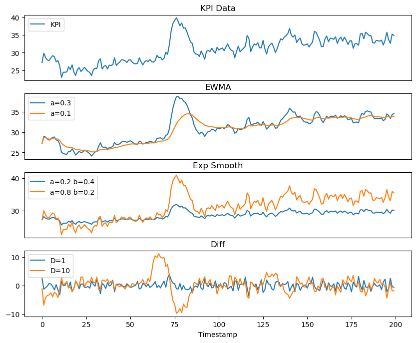
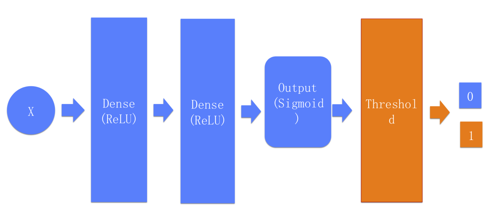
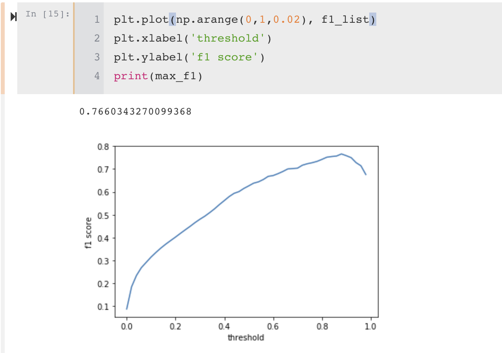

## Report For Our Method

### 方法

1. 特征工程
2. VAE生成异常数据用来平衡正负样本分布差异
3. Deep Neural Network训练数据
4. 调整threshold进一步提升模型的表现效果

### 特征工程

为了更好地获得KPI数据的特征，我们使用了如下特征工程：

1. **一阶指数平滑（加权指数移动平均，EWMA）**

   一阶指数平滑是一种常用的时间序列平滑的方法，是以指数式递减加权的移动平均。加权的程度以常数$α$决定，$α$数值介于$[0,1]$。

   设时间*t*的实际数值为$Y_t$，而时间$t$的EMA则为$S_t$；时间$t-1$的EWMA则为$S_{t-1}$，计算时间$t≥2$是方程式为：

   ​	$$S_1=Y_1$$

   ​	$$S_{t}=\alpha \times Y_{t}+(1-\alpha )\times S_{t-1}$$

   实验中，我们选取了5个不同的参数：

   $$\alpha=\{0.1, 0.3, 0.5, 0.7, 0.9\}$$.

2. **二阶指数平滑**

   由于一阶指数平滑不能很好的表达序列中存在趋势（trend）分量的情况，所以在一阶指数平滑的基础上引入二阶指数平滑，定义如下：

   ​	$${ \begin{aligned}S_{1}&=Y_{1}\\b_{1}&=Y_{1}-Y_{0}\\\end{aligned}}$$

   在$t>1$时，有：

   ​	$${\begin{aligned}S_{t}&=\alpha Y_{t}+(1-\alpha )(S_{t-1}+b_{t-1})\\b_{t}&=\beta (S_{t}-S_{t-1})+(1-\beta )b_{t-1}\\\end{aligned}}$$

   其中，$\alpha$定义与一阶指数平滑类似，$\beta \in [0,1]$	为趋势平滑因子（*trend smoothing factor*）。

   实验中，我们选取了4组不同的参数组合：

   $$\alpha=0.2, \beta=0.4$$

   $$\alpha=0.4, \beta=0.6$$

   $$\alpha=0.6, \beta=0.4$$

   $$\alpha=0.8, \beta=0.2$$

3. **一阶差分**

   一阶差分类似一阶导数，可以表示序列变化的快慢程度。一阶差分序列的定义如下:

   ​	$$\Delta_h(t) = Y_t - Y_{t-h}$$

   实验中，我们选取了15个不同的参数：

      $$h={-5, -1, 1, 5}$$

下图是3组特征工程的示意图，第一行的曲线代表原始的KPI时序，第二行是两种参数下的一阶指数平滑，第三行是两种参数组合下的二阶指数平滑，第四行是两种参数下的一阶差分序列。

### VAE生成异常数据

通过VAE生成模型生成新的异常样本点，从而平衡数据分布，可以使用binary cross entropy训练模型。我觉得华为汇报的PPT里面那张图画的模型结构图挺好的～

### 网络结构

### 调整threshold从而让模型达到最好的数据集表现

通过plot出threshold关于f1 score的曲线 从而确定出threshold的最优取值，如下图

### 最终结果

我们分别在26个不同kpi数据集上测试了模型的结果，每个kpi结果如下图所示：

|      kpi_id      | accuracy | f1_score | precision | recall |
| :--------------: | :------: | :------: | :-------: | :----: |
| 09513ae3e75778a3 |  0.9969  |  0.2957  |   0.34    | 0.2615 |
| 769894baefea4e9e |  0.0006  |  0.0000  |  0.0000   | 0.0006 |
| 71595dd7171f4540 |  0.9972  |  0.8128  |  0.8318   | 0.7946 |
| 18fbb1d5a5dc099d |  0.9975  |  0.9795  |  0.9706   | 0.9885 |
| 88cf3a776ba00e7c |  0.9785  |  0.7896  |  0.7967   | 0.7825 |
| a40b1df87e3f1c87 |  0.9994  |  0.8874  |  0.9054   | 0.8701 |
| 40e25005ff8992bd |  0.9985  |  0.883   |  0.9286   | 0.8417 |
| 046ec29ddf80d62e |  0.9824  |  0.4918  |  0.8824   | 0.3409 |
| 9bd90500bfd11edb |  0.9999  |  0.9508  |  0.9355   | 0.9667 |
| 9ee5879409dccef9 |  0.9735  |  0.7116  |   0.774   | 0.6585 |
| 8bef9af9a922e0b3 |  0.9983  |  0.7887  |  0.7636   | 0.8155 |
| 07927a9a18fa19ae |  0.9932  |  0.7273  |   0.625   | 0.8696 |
| 1c35dbf57f55f5e4 |  0.9931  |  0.9543  |  0.9533   | 0.9552 |
| c58bfcbacb2822d1 |  0.9986  |  0.3509  |  0.3333   | 0.3704 |
| affb01ca2b4f0b45 |  0.9984  |  0.8209  |  0.7801   | 0.8661 |
| 02e99bd4f6cfb33f |  0.9624  |  0.7782  |  0.7829   | 0.7736 |
| 8a20c229e9860d0c |    0     |  0.000   |     0     |   0    |
| a5bf5d65261d859a |  0.9999  |  0.9091  |  0.9091   | 0.9091 |
| da403e4e3f87c9e0 |  0.9996  |  0.9965  |  0.9968   | 0.9962 |
| 7c189dd36f048a6c |  0.9991  |  0.8462  |  0.8462   | 0.8462 |
| 54e8a140f6237526 |  0.0006  |  0.0012  |     1     | 0.0006 |
| e0770391decc44ce |  0.9984  |  0.9635  |  0.9681   | 0.9589 |
| cff6d3c01e6a6bfa |  0.9978  |  0.8429  |  0.8233   | 0.8634 |
| 8c892e5525f3e491 |  0.9988  |  0.9709  |   0.982   |  0.96  |
| 76f4550c43334374 |  0.9824  |  0.4561  |  0.7647   | 0.325  |
| b3b2e6d1a791d63a |  0.0006  |  0.0000  |  0.0000   | 0.0006 |

注意到上述存在4个kpi id的数据集f1为0的情况 这里我们认为是测试集label全为0 所以导致计算出现问题，非代码bug。由数据大小加权得模型在整体数据集f1 score为0.80。
