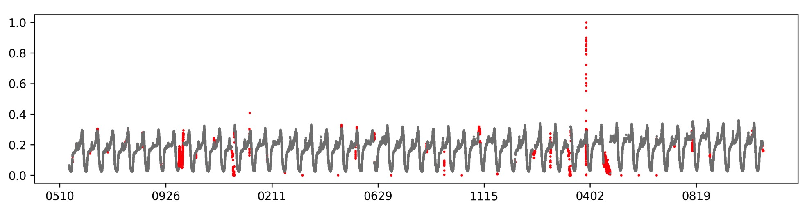
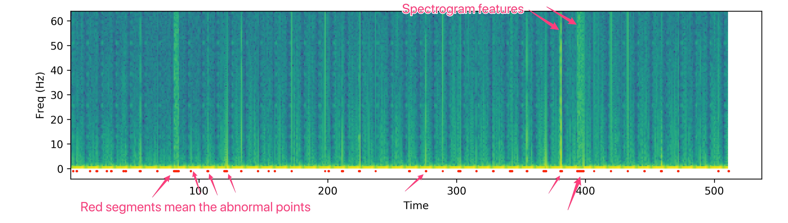
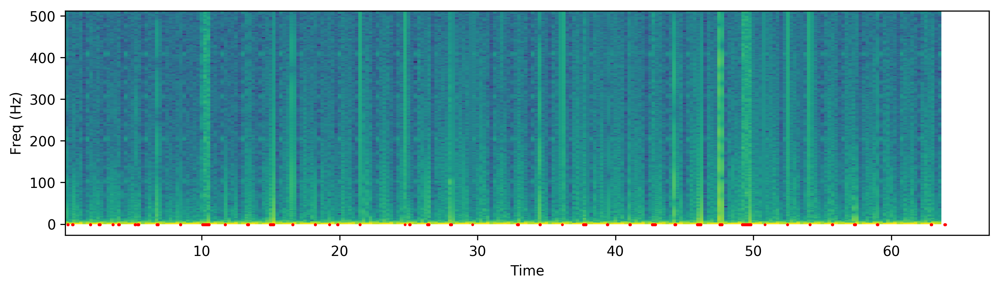
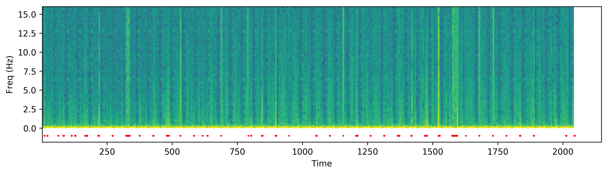

# Report2: Testing based on Wavelet Analysis and BiLSTM 

Tao Sun (1652175)

Oct. 13 

## Test for Wavelet Analysis

### Introduction to Wavelet analysis

From the KPI plot we can found significant perodical features. This remains us that we can deep into the frequency features of the KPI data (or wavelet analysis). According to Fourier analysis any physical signal can be decomposed into a number of discrete frequencies, or a spectrum of frequencies over a continuous range. The statistical average of a certain signal or sort of signa as analyzed in terms of its frequency content, is called its spectrum.

To begin with, let us focus on the specgram below. 

The following two plots shows a specgram with different setting. The first has a sample rate of 1024 points, NFFT is 512, and the second has a sample rate of 32 points with NFFT is 256. Although there is some subtle different, they doesn't differ a lot. So we chose the one specgram with seemingly setting. 

From the plots, we can find that abnormal plots have a different feature in the specgram, which is more obvious than the points on time-domain. From these points of view, we can append some frequecy-domian features into our feature group.

### Results

Based on the previous the Dense Network of the Champion, I performed some experiments. Only one category (category 12, which have a average amount of points) is used in this test. The first 80% of the data are for training data and the remaning are for validation. Frequency features do help the network improve to some extent. We can also find that the high-frequency component  take a major part in this improving. 

| Metrics on Val. set (%) | Accurancy | Recall | Precision | F1 Score |
| ----------- | --------- | ------ | --------- | -------- |
| w/o frequency features | 98.83      | 49.13 | 50.48     | 51.72    |
| with 0-32 Hz  | 98.89    | 49.40  |   50.29   | 51.57  |
| with 32-64 Hz  | 99.02     | 49.77  |   49.93   | 53.45   |
| with 0-64 Hz  | 99.10     | 49.87  |   59.58   | 54.29   |

## Test for Bi-LSTM method

### Introduction to Bi-LSTM

Bi-directional RNNs use a finite sequence to predict or label each element of the sequence based on the element's past and future contexts. This is done by concatenating the outputs of two RNNs, one processing the sequence from left to right, the other one from right to left. The combined outputs are the predictions of the teacher-given target signals. This technique proved to be especially useful when combined with LSTM RNNs.
Long short-term memory (LSTM) units are units of a recurrent neural network (RNN). An RNN composed of LSTM units is often called an LSTM network. A common LSTM unit is composed of a cell, an input gate, an output gate and a forget gate. The cell remembers values over arbitrary time intervals and the three gates regulate the flow of information into and out of the cell.

### Results

I used in the same feature group as I mentioned previously. Only one category (category 12, which have a average amount of points) is used in this test. The first 80% of the data are for training data and the remaning are for validation.

| Metrics (%) | Accurancy | Recall | Precision | F1 Score |
| ----------- | --------- | ------ | --------- | -------- |
| Training    | 98.29     | 50.29  | 49.75     | 49.40    |
| Validation  | ---       | ---    | ---       | ---      |

But the model had not converged yet due to the large amount of weights of BiLSTM model. However, it is safe to say that this model will be not inferior to the others. I will report the results in future reports.

