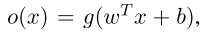
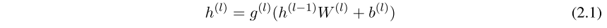

深度学习网络应用于异常检测

目标： 使用神经网络 可靠识别工业生产【双缸洗衣机的传感器】的传感器监测数据异常 

方法：VAES，GAN

## 2.2 机器学习

### 2.2.1 深度学习的概念

### 2.2.2 人工的神经网络

本章对一些常见的神经网络，其原理，不足，和常见的应用及表现进行了简述。

**前馈神经网络** ：

​	输入vector x ∈ R^(dx)，输出vector y ∈ R^(dy)  learned function： y = f(x; θ) ，fθ : X → Y

​	相邻层间细胞全相连的神经元层堆，每一个神经元自身可以视作一个简单的regression单元。

​	单一的神经元被定义为其中输入向量x∈R^(dx)，b是偏置项。g 是非线性的转换方程：常用 sigmoid,tanh, ReLu 线性整流函数。 ReLu 可以改善模型并显著加速模型收敛{参数趋于稳定，每一轮更新纠偏的浮动很小}的时间。

​	多层的神经网络的数学描述形如下式（2.1）： l=1,2,.....L，其中第一层时输入，h^(L) 是输出 y

​	W∈R^(dh(l-1)*dh(l)) 以及一个偏置项b∈R^(dh(l))，其中dh(l)等于intermediate 层的单元数		量。计算时间上，虽然每一层之间都是全连接的，但是层内的单元之间计算是并行化的。g^(l)则是并行式地对层L上的每个单元进行了激活

​	sigmoid 函数常被用做全连接classification网络的最后一层，其值∈[0,1]。除此之外softmax 函数也被用来输出一个归一化的概率分布 p(y|x) 满足，满足

其中ci代表多分类任务的第i类。

​	神经网络训练包括 **1、前向传播**：输入被处理并计算期望的输出值

​						**1.5、估计模型的最优化的参数集** 梯度下降是一个可行方法

​					**2、反向传播**：针对一个cost / error 函数 J(θ)，θ是模型的参数，计算	

​					∇θJ(θ)，去更新θ

​	 针对前馈神经网络 : J(θ)对每一层的参数的偏导，可由输出层反向链至当前层。

​	 深层神经网络结构的过拟合问题可由引入正则化网络，常用方式是对网络层单元进行dropout，具体是指在每一轮训练时，对网络中的单元随机×0，进行 deactivation 化

**RNN 递归神经网络**：一种特殊的神经网络的架构。输入数据间的时间依赖性被有效的融入了。网络每一time步都与previous一time步的反馈输出相连。在时间轴上展开的神经网络每层的参数是一致/共享的。由于网络可以根据时序列长度动态扩展，因此时解决序列建模的合理方法。

​	一个多层的RNN如下图所描示，与前馈2.1相比多了时间语境

​	其中第一层接受的是t时刻的输入X t。在t=0时，网络每层的反馈回路输出h^(t)是认为初始化的值。

​	RNN的训练方式是[BPTT](https://zhuanlan.zhihu.com/p/26892413 ) ，与前馈不同的是TT，历时反播。一个复杂的递归神经模型实现类似baseline前馈网络的end-to-end架构。因为，展开的RNN与前馈网络的区别仅在展开层参数的层间共享这一限制上。因此，用来更新weight的梯度下降的偏导计算可以在每一个time step进行，并累加。{例如输入一句句子，到末尾后，更新}

​	但凡事具两面性，由于梯度的反向传播是对整个深度网络的参数更新化，针对RNN，这一复杂结构的网络，直接迁移前馈网络的梯度下降算法，将会带来应用层面上的问题，如梯度消失，或者梯度爆炸。因此不难理解，对于长序列数据中的长期时序依赖很难进行建模

**LSTM 长短期记忆网络**:  本质是带阀门的递归神经网络RNN。基础的想法是随着时间增加path(s)，这些paths不会出现

[数据预处理：独热编码（One-Hot Encoding）](https://blog.csdn.net/pipisorry/article/details/61193868)

One-Hot编码是对无序离散特征的编码方式。应用场景有：某一特征，上具有n种选项，该特征内部假设无关相似关联，那么若以数值1代表第一个选项，数值2代表第二个选项，以此类推，以n代表第n个选项，那么，易见，样本点计算相似度时，在该维特征上，会引起偏差不公。注意，当样本不进行特征独热编码的预处理也能合理计算距离，则无需。

[多层LSTM的通俗讲解版](https://blog.csdn.net/Jerr__y/article/details/61195257)

[一个LSTM在排列三下期开号上的应用](https://github.com/chengstone/LotteryPredict)

想通过案例看一下，LSTM的实战应用方式。预测accuracy为0，代表彩票不可预测，毫无历史性fixed的规律可言。

深度学习可以胜任自然语言翻译功能，微软小冰可以象人一样带有同理心的和你聊天，了解人的心理。还可以学习，该如何像人一样，富含情感，甚至嗓音不完全完美地去歌唱。这些可以看作是以人类为模板的学习？如何定义我们可以训练机器拥有超越人类的学习能力和任务表现{综合任务，专业任务}？

**CNN 卷积神经网络**：

1. [卷积神经网络工作原理的直观解释](https://www.zhihu.com/question/39022858)
2. [CNN流程简单梳理](https://h312903294.github.io/cnn/2017/12/13/cnn-note/)
3. [更详尽的卷积神经网络入门](https://zhuanlan.zhihu.com/p/22493551)
4. [批梯度下降/随机梯度下降](https://blog.csdn.net/lilyth_lilyth/article/details/8973972)
5. [卷积神经网络CNN理论到实践](https://blog.csdn.net/github_36326955/article/details/73089831)

=====================================================================

**针对** **1**

例子：输入一张RGB 彩图  32 * 32 * 3，指定第一层卷积层训练12个滤波器，则第一层输出 32 * 32 * 12 ，可以得到12个对于低阶特征，诸如边，角，曲线的激活图。在此卷积层输出基础上进行池化，或者非线性变换，或者全连接处理，后得到的输出，以此为基础进行第二次n个滤波器训练，输出32  * 32 * n ，再进行卷积层输出处理，喂入下一个卷积层 。这样的训练过程历次迭代，则可以得到能滤出高阶特征的核，及其对应的激活图：比如人脸，狗脸...。

训练：每一个网络都有其定向识别的任务。比如分类任务，如果有12个类，那么输出可表示为1*12的0-1向量，如果这12类是互斥的则输出的限制有（1），同时也可以指定损失函数，来表示当前模型的表现与训练者预期中的偏差，所以，loss-function的值越大，代表当前模型学习的参数在任务上表现愈差。
$$
sigma(yi)=1,i=1,2...12，（1）
$$
当某次输出计算的loss-function(网络参数)未达到预期小时，通过回传，使这个最后一层的预测输出传至网络每一层，对各层参数进行校正更新，来提高下一次的任务表现，减低loss

====================================================================

**针对3**

SGD与BGD的区别：BGD，batch gradient descent 是针对整个样本集，J(θ)是对所有样本xi  i=1,2...,|S|，的学习情况一个量化的指标。并计算梯度，来更新θ，追求一个全局的学习结果优化趋势。而SGD中，J(θ) 是针对每条样本的学习情况的一个量化的指标，并进行梯度下降更新的，因此不一定获得全局的学习情况最优，除了一个特殊的情况，那就是J(θ)这个抽象计算公式，可以预期到，它就只有一个最优点。

====================================================================

特征映射，一层卷积层可以抽取K个图片中的特征，多层卷积层，则可以迭代抽取复杂的图像特征，输入二维图像的明暗变化，位置变化不受影响。

然而，多元时间序列不需要非时间轴上局部特征的位置不变性。相反，位置对于模式的检测可能至关重要。多元时序数列中的异常模式检测，模式/特征出现的位置是

## 2.3

2.3节 主要讲述了深度学习在异常检测中的应用的一些方式，以及这些方式的motivation。

一种出于既知思维的考量方式，已知了一些可能发生的，在本文的domain中，对于洗衣机出现的故障现象，例如洗衣粉放多了脱水期卡壳，之类异常停机。对于超前习得了某一领域内的异常 [反之即正常]，对此本文介绍了最近的使用神经网络对训练样本进行分类的模型。

另一种考量方式是，神经网络的初衷是模拟人类大脑。那么，intuitively，人们对于异常的识别，可视作对超出大脑储存库内的常识，前所未闻，异于常态的模式的recognition。对此辩证的看，虽然人天生好猎奇，但如果当这类pattern或事情多次出现，我们将会不感兴趣，its just a normal case。因此，本文另介绍了应用神经网络对可用数据点中的正常数据序列建模，以区分abnormal的三类模型：预测模型，自编码模型，生成对抗模型

由于本篇论文使用的方式之一是Autoencoder ，因此，先来看2.3.3的自编码模型的原理。

[自编码模型原理](https://zhuanlan.zhihu.com/p/24813602)

一个child自编码模型长像 like this ：

上图是一个简单的autoencoder模型,通常也被称作encoder-decoder。上图中的自编码model具有全相连且左右对称的网络结构。观察可知，中间是整个encoder-decoder模型中单元最少的网络层Layer0。

通常以Layer0作为输出层，连同其左侧的所有网络层一起，是一个encoder，以Layer0作为输入层，连同右侧的所有网络层一起视作一个decoder。易见，在该图中encoder是一个逐层神经元的数量呈现下降趋势的全连接网络模型，而出于对称性，decoder的网络层内神经元数量呈现逐层增长的趋势。

而auto代表这个模型是自主的学习好参数的，属无监督学习类。因为，它的label就是原来的自己，整个过程极似一个社交的过程，常会对他人自动生成一个人物的画像，。autoencoder常被用来做类似PCA的特征降维，即从数据中先让autoencoder自动学出其中最具其代表性的特征，即需要最少神经元承载的Layer0层，对比图中输入层的神经元数量与Layer0，前者是后者的5倍数量{信息量}。

具体来看，自编码网络model进行自主学习时的算法采用的是baseline前馈神经网络的反向传播算法。

然后，这篇论文中作者描述了自编码模型在异常检测中起到的作用。

[关于基础的seq2seq模型](https://zhuanlan.zhihu.com/p/27608348)

模型依然类似预测模型是seq2seq架构的，所不同的是，是对正常数据的特征重构序列

