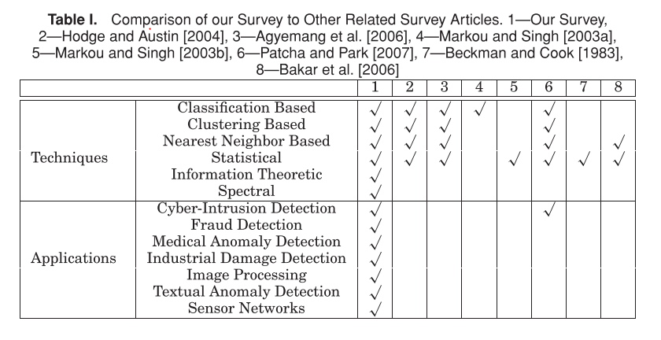

1、Techniques overview

Chandola, V., Banerjee, A., & Kumar, V. (2009). Anomaly detection. *ACM Computing Surveys*, *41*(3), 1–58. https://doi.org/10.1145/1541880.1541882

The difference between **Spectral** and **Statistical**，what is all about **Information Theoretic**

**Information Theoretic:** Use a series of  information theoritical measures like entrophy , the approach is based on the *assumption* : anomalies induce  irregularities in the information  content of the data set 

Let C(D) denote the complexity of a given data set, D. A basic information theoretic
technique can be described as follows.Given a data set D, find the minimal subset of instances, I, such that C(D) − C(D − I) is maximum.All instances in the subset thus obtained, are deemed as anomalous. 

The complexity of  a data set (C) can be measured in different ways. Kolomogorov complexity [Li and Vitanyi 1993]，entropy, relative uncertainty,

*Computational Complexity* has the basic information theoretic anomaly detection technique.Approximate techniques proposed with linear TC.

2、Techniques that are used in Fraud Detection

