# PRML阅读笔记

1552970 李向真 2018.10.13


## 1绪论

* 模式识别：

  数据 + 计算机算法 ——> 自动识别规律 ——> 利用规律对数据分类

* 基本要素：

  训练集（training set）：数据通常被独立考察、人工标注，

  测试集（test set）

  泛化（generalization）：正确分类与训练集不同的新样本的能力

  预处理（pre-process）：特征提取等

* 分类：

  * 监督学习（supervised learning）：样本包含输入向量及对应目标向量

    ​	分类（classification）：输出向量为离散标签

    ​	回归（regression）：输出向量为连续变量

  * 非监督学习（unsupervised learning）：训练集无目标向量

    ​	聚类（clustering）：相似样本分组

    ​	密度估计（density estimation）：决定输入空间中的数据分布

    ​	数据可视化（data visualization）：数据从高维投射到二维或三维空间

  * 反馈学习（reinforce learning）：给定条件下，找到合适动作，使奖励达到最大。

    ​	探索（exploration）：尝试新类型动作

    ​	利用（exploitaion）：使用已知能产生最高奖励的动作


###1.1曲线拟合示例：

* 参数过多：导致过拟合（over-fitting）
* 解决：正则化（regularization），引入惩罚因子，本质上是在调节模型的复杂度。


### 1.2概率论（贝叶斯概率）

这部分讨论概率论的理论。

贝叶斯概率与国内大学讲授的基于频率的经典概率理论相比，在表达形式上看起来很相似，但对概率问题的理解角度却截然不同。

由于还参看了其他资料，内容较为杂乱，没有按原文组织。


####1.2.1三类基本概率

从贝叶斯概率的角度出发，不讨论一元的简单概率，主要关注一下三类概率：

* 联合概率（joint probability）：

  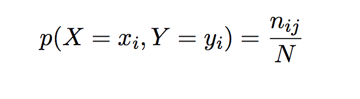

X 取值xi 且 Y 取值 yi

* 边缘概率（marginal probalibity）：

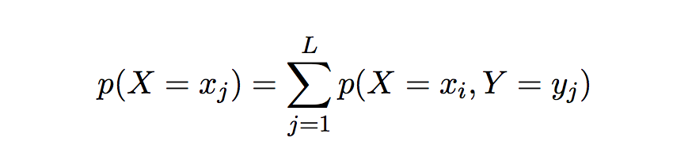

* 条件概率（conditional probability）：

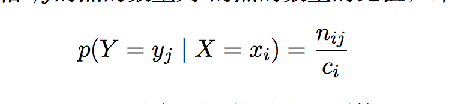

#### 1.2.2两个基本规则

贝叶斯概率的基本规则也是加法规则和乘法规则，于经典频率概率的理解角度不同，所以对“加”和“乘”的形式也略有不同。

* 加法规则：

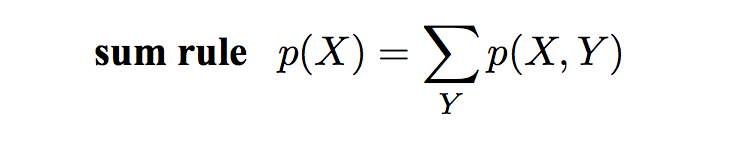

即为边缘概率求解公式

频率概率：P(A∪B)=P(A)+P(B)-P(AB)

* 乘法规则：

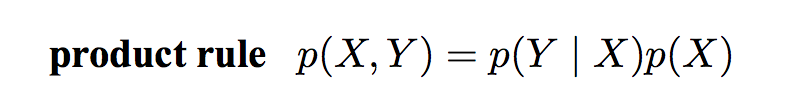


即为条件概率连乘


#### 1.2.3贝叶斯公式

贝叶斯公式如下：

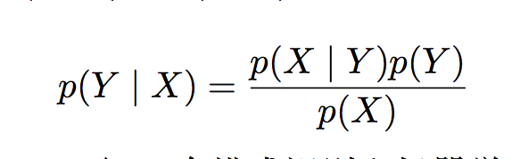

其中，分母又可以表示为：

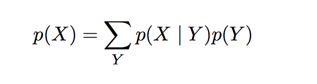


经典频率概率模型和贝叶斯概率模型对这个公式的解释有着本质区别。


### 1.3经典频率模型与贝叶斯模型

#### 1.3.1经典频率模型

* 理论基础：大数定理
* 典型例子：骰子，硬币问题，大量实验，得出频率近似概率
* 问题：
  * 地震概率，恒星爆炸概率，无法通过重复试验获得
  * 冰川融化，随着诸多因素改变，需要不断修正
* 参数估计方法：
  * 矩估计(momnet)
  * 极大似然估计（maximum likehood estimate）


#### 1.3.2贝叶斯概率的切入点

以一个经典问题为例：

```
一种癌症，得了这个癌症的人被检测出为阳性的几率为90%，未得这种癌症的人被检测出阴性的几率为90%，而人群中得这种癌症的几率为1%，一个人被检测出阳性，问这个人得癌症的几率为多少？
```

按照大学教材中频率概率的观点，套用贝叶斯公式，可以很容易算出结果。

从贝叶斯观点来看，求解过程不重要，重要的是各个概率间的关系。


P（Y）为得癌症的先验概率，也就是对任何一个人，其他条件未知情况下，主观认定的癌症概率

P（Y|X）为后验概率，即为发生了X事件（检出阳性）后，对先前患癌症概率的修正。

P（Y）为0.01，而P（Y|X）为0.083，也就是说，发生阳性的事件修正了人们对得癌症几率的判断。

贝叶斯概率就是在发生新事件后，不断修正原有认知的迭代过程。

因此，从贝叶斯的角度，***概率定义为某人对一个命题信任的程度的概念***。


#### 1.3.3机器学习与贝叶斯概率

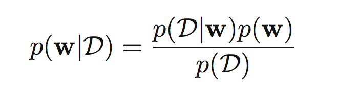

对与训练集D，模型参数w，

从经典观点来看，w是一个确定的值，由训练集D通过极大似然估计等方法得到，w的准确性通过置信区间来度量。频率派把须要判断的參数θ看做是固定的未知常数。即概率尽管是未知的，但最起码是确定的一个值，同一时候，样本X 是随机的，所以频率派重点研究样本空间，大部分的概率计算都是针对样本X 的分布。

从贝叶斯观点来看，求解的不是w具体某个值，而是w的概率分布，参数不确定性通过w的概率分布来表达。他们觉得參数是随机变量，而样本X 是固定的，由于样本是固定的，所以他们重点研究的是參数的分布。

p（w）是先验概率，即在没有训练集D的情况下对w的主观认知，很多时候这个值是人主观估计的，比如假定为均匀分布，这也是贝叶斯理论被攻击的重要原因之一。

p（D|w）通过训练样的分布来估计，我们认为参数w是客观存在的，在这种情况下发生的D事件。它也叫“似然函数”，表达了在不同的参数向量w下，观测数据出现的可能性的大小

p（D）本质上是一个归一化常数，他的存在是为了使左侧概率后验概率积分为1。

贝叶斯概率的这种形式，使得可以用迭代形式修正后验概率分布，而经典频率模型只能每次用全部数据重新估计参数w。


本质上，贝叶斯定律可抽象为这样的形式：

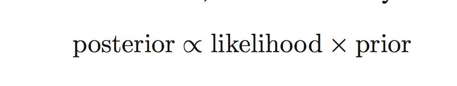


也就是说，后验概率正比于似然函数和先验概率的乘积。

贝叶斯对问题的求解模式即为：先验分布 + 样本信息 ——> 后验分布

先验信息来源于经验和历史资料。


## 2.贝叶斯网络

### 2.1基本概念

* 拓扑结构：有向无环图
* 作用：描述联合概率分布各个随机变量之间独立与依赖关系
* 动机：联合分布建模导致维度灾难，故而用图的形式进行有效建模

### 2.2描述方法

* 为每个随机变量引入一个节点
* 为每个条件概率分布增加边，起点为条件变量，重点为目标随机变量


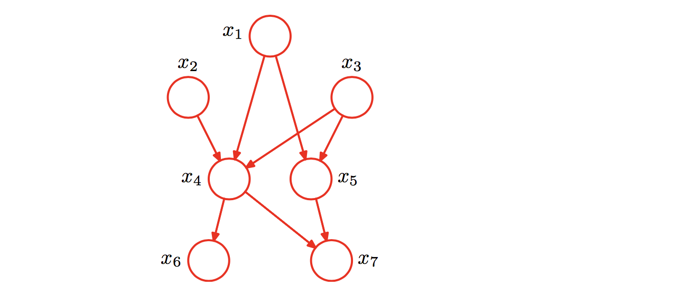

如上图对应联合概率分布为：

```
p(x1)p(x2)p(x3)p(x4|x1,x2,x3)p(x5|x1,x3)p(x6|x4)p(x7|x4, x5)
```


### 2.3独立性检测——d-separation

#### 2.3.1条件独立

P（a,b|c）=   P(a|c)*P(b|c)

给定c的条件下，a条件独立于b

#### 2.3.2三类典型关系

* 尾对尾

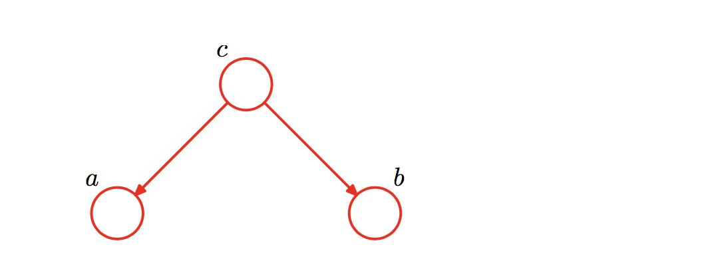 


没有观测变量，即c未知情况下，a和b不独立

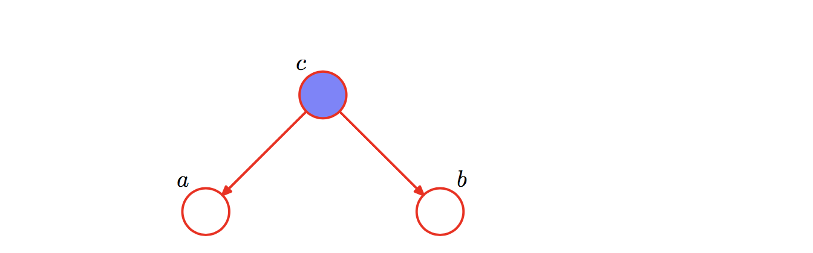 

c为观测变量的情况下，a条件独立于b


* 头对尾


没有观测变量，即c未知情况下，a和b不独立


c为观测变量的情况下，b条件独立于a


* 头对头

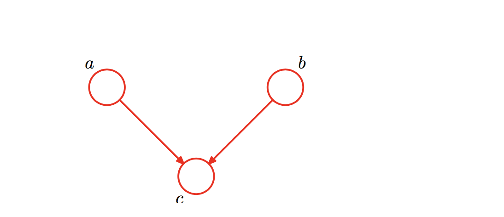

没有观测变量，a条件独立于b

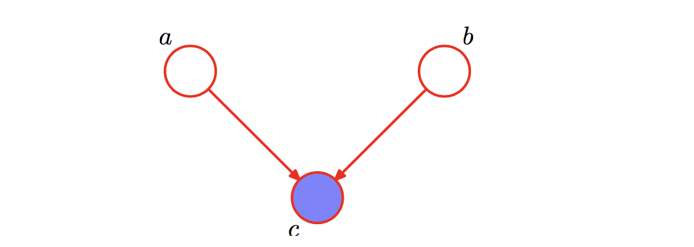

c为观察变量的情况下，a和b不独立

#### 2.3.4 d-separation

总结三类图结构可以总结出d-separation算法，用以判断节点集合间的条件独立。

对于任意的结点集A，B，C，考察所有通过A中任意结点到B中任意结点的路径，若要求A，B条件独立，则需要所有的路径都被阻断(blocked)，即满足下列两个前提之一：

* A和B的“head-to-tail型”和“tail-to-tail型”路径都通过C；
* A和B的“head-to-head型”路径不通过C以及C的子孙；


### 2.4应用

朴素贝叶斯模型：垃圾邮件分类

