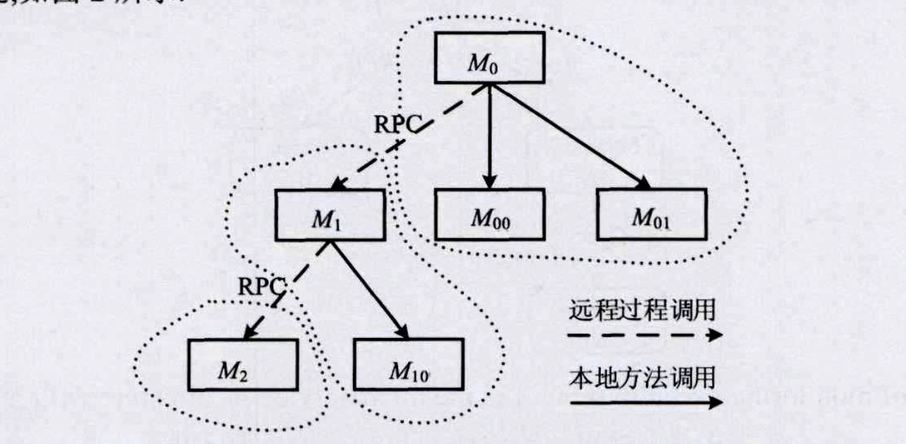
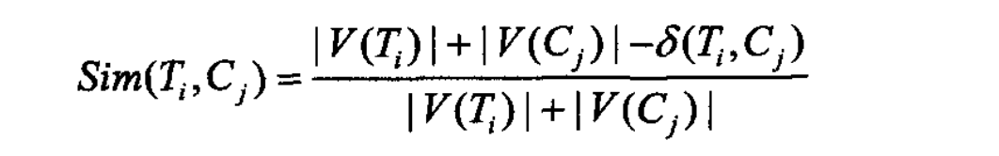
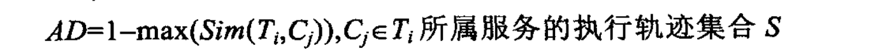
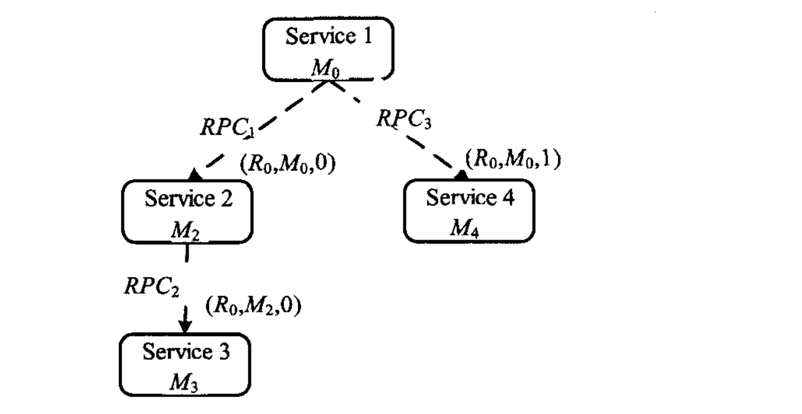
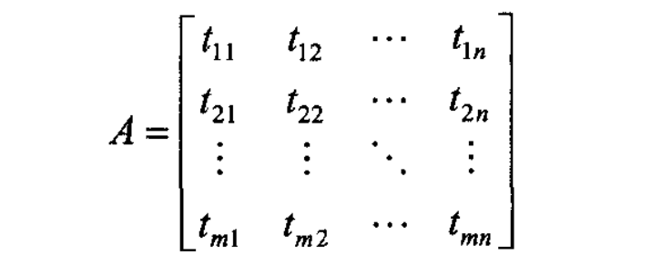
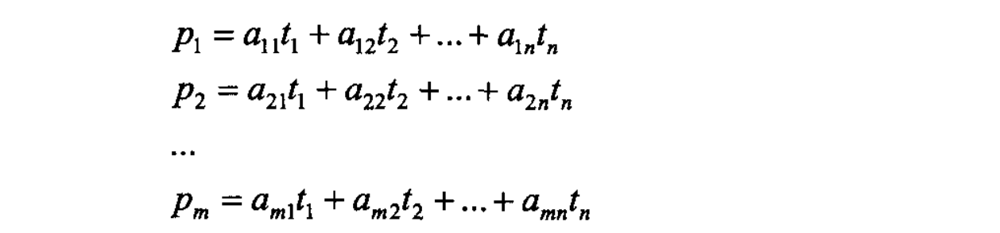

# 执行轨迹检测诊断

1552970 李向真 	2018.10.19

## 一. 内容概要

介绍了一种在云平台中，检测异常并定位异常的方法

方法核心基于对原有代码进行字节码级注入，从而定位每个请求的执行轨迹

可以检测并定位系统结构异常和性能异常两类问题

## 二. 各部分要点

### 1.介绍

网络应用复杂性增强	——>	促使微服务兴起

微服务存在问题：

* 组件多，依赖复杂
* 故障随模块间调用扩散

引出故障定位需求，人工方法不适用（检测规则制定，细粒度定位）

文章的方案：基于***执行轨迹检测***

* 利用跨服组件检测并刻画执行轨迹
* 故障诊断
  * 系统错误：调用树距离编辑
  * 性能：主成分分析

贡献：

* 跨组建执行轨迹**检测** + 执行轨迹**刻画**和**自动构建**
* 系统异常评估（树编辑距离），问题定位（宽度优先）
* 性能异常检测与问题定位（主成分分析）
* 错误注入验证

研究思路：

* 执行轨迹检测：动态插桩方式。在方法调用处插入检测代码，远程调用协议中加入方法调用关系
* 执行轨迹构建：
* 故障诊断：
  * 系统错误：执行轨迹变化，用树的编辑距离来评估异常
  * 性能异常：资源竞争导致性能衰减，用主成分分析降为

### 2. 执行轨迹检测与构建

#### 2.1模型刻画的定义

一个调用树由三种元素组成：

* 服务组件（虚线包围的节点集）
* 方法调用（节点）
  * M =(requestUID ，methodUID ，caller UID ，calleeList，info)	，刻画一个方法调用需要：请求ID，方法ID，父方法ID，调用的字方法列表，方法其他信息
  * info = ( call T y p e ，s e r v i c e U I D ，o r d e r ，s t a r t T i m e ，e n d T i m e ，d u r a t i o n )其他信息包括调用类型（远程、本地），服务ID，调用顺序（order），开始／结束时间，方法执行时间（不包括子方法），后几项数据是为了确定构建树时的父子顺序。
* 调用（箭头线）
  * 远程过程调用（非本服务组件）
  * 本地过程调用（本服务组件）

#### 2.2执行轨迹检测

##### 2.2.1 三大难点

* 多个请求调用一个服务组件，彼此区别：requestUID
* 组建间方法的调用关系：callerUID, methodUID
* 多组件服方法调用顺序确定：各节点时钟难以同步

***操作维度*** ：对JAVA字节流操作，不是从业务代码上改的

##### 2.2.2 算法过程

* 确定根节点：入口方法
* 先按照requestUID筛选，各个服务根据方法调用关系构建子数
* 子树链接起来：自顶向下，宽度优先
* 去冗余：
  * 有公共父节点的循环调用合并
  * 有父子关系的重复递归调用合并

##### 2.2.3 执行轨迹构建

存在参数检查、分支

同一服务请求处理过程存在多种执行轨迹

构建执行轨迹集合，把同一请求过程的多种轨迹并到一个集合里。

构建集合的算法很朴素，就是不断搜索可能的新轨迹，将其装入集合中，得道其所有可能执行的轨迹集合。

### 3.故障检测

这部分分两块，结构故障（系统错误）和性能异常故障

#### 3.1 结构故障

* 核心思路：一直请求正常执行时的轨迹集合，评估新的请求轨迹偏离正常轨迹集合的程度

* 算法：树编辑距离（一棵树通过增、删、改，转换为另一颗树的代价）

  * 请求某一服务的执行轨迹集合为 C = { C1, C2, C3 …...  }

  * 某次请求 i 的执行轨迹为 Ti

  * 分别求出每一组 {Ti, Cj} 的编辑距离 

  * 定义相似度概念：（V表示节点数）

  * 定义基于相似度的异常评估：

  * 定义阈值 ${\gamma}$ , 若AD大于${\gamma}$ 则发生异常，

    ${\gamma}$ 大小选取较为关键，根据领域经验设为0.15

* 错误定位：错误粒度——方法级

  * 由AD得到与Ti最相近的树Cj
  * 广度优先遍历，比较二者节点，找出异常节点

***（此处有问题，太理想化，恐怕难以应对微服务依赖复杂，易扩散的性质，是被Ranger否定的方法）***

#### 3.2性能异常故障

##### 3.2.1核心思路

核心思路：同一执行轨迹的执行时间相对稳定，若出现大幅波动则可以认为是有异常发生。

方法：这部分的方法主要采用统计学非常常见的方法和定义，亮点很少

##### 3.2.2 性能异常程度的定义

为了定义性能异常的程度，文章实际上借用了统计学中变异系数（CV）的概念。CV的统计学意义是反映单位均值上的各指标观测值的离散程度，这里用作反映系统处理请求响应时间的波动情况。

xi为第i个请求的响应时间

##### 3.2.3 成分分析

实际情况，轨迹的调用可能很多，存在方法间调用，有数据冗余，利用主成分分析筛选。

为了将树形的数据转化为线性数据，用深度优先进行搜索，得到线性便利序列

（此处用DFS有个小细节，是为了保持时序性）

由遍历序列组成矩阵

t_ij表示请求i调用方法Mj的执行时间

经过主成分分析，将n个维度压缩为m个

对成分因子进行权重分析得到影响执行时间的主要因素，定位主要方法。管理员人工判断异常。

（个人认为这种方法是有问题的，主成分分析只是个降维过程，分析出主成分，不代表非主成分不会发生异常，执行时间长的权重大，执行时间短的发生异常无法得知）

### 4.试验验证

测试套件Bench4Q

这部分介绍完工具就直接抛出试验结果，缺少细节。

### 5. 相关工作

这部分介绍与相关工作相比的优势，其中提到的各个工具可能比较有价值

* Kubernets，Netlfix Hystix等基于度量的监控，只能定位到服务级
* Project5，WAP5，Sherlock等是***黑盒系统***（类似Ranger），不够精确，推断关键路径时有较高的复杂度。
* Pivot Tracing 不能实现方法粒度的诊断，不具备自动故障诊断能力，训练构造有一定难度。

### 6. 进一步工作

- 动态代码注入时的方法遗漏问题
- 插桩数过多影响性能，合理插桩。

### 7. 对比

|        | 轨迹检测法                          | CloudRanger                   |
| ------ | ------------------------------ | ----------------------------- |
| 系统透明性  | 白箱                             | 黑箱                            |
| 捕捉异常数据 | 由请求调用轨迹判断结构故障，轨迹的执行时间判断性能故障    | 通过延迟和吞吐量来判断，需要选择合适time window |
| 拓扑结构   | 通过插桩捕获调用轨迹图，是实际的物理图            | PC-algorithm构建的影响图，是逻辑图       |
| 异常定位   | 系统故障由轨迹树BFS搜索对比得到，性能异常由主成分分析得到 | 二阶随机游走搜索（本质上类似于启发式搜索）         |
| 模型复杂度  | 复杂度相对小，比较朴实的方法                 | 相对复杂                          |

