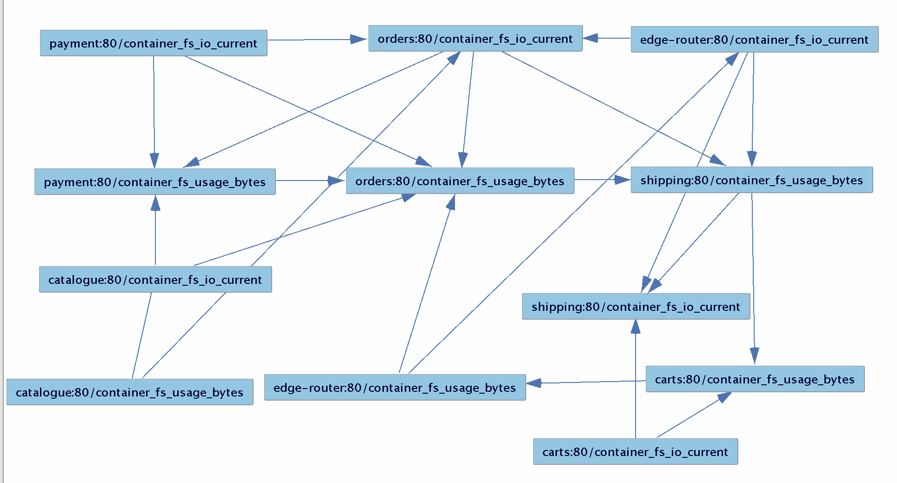
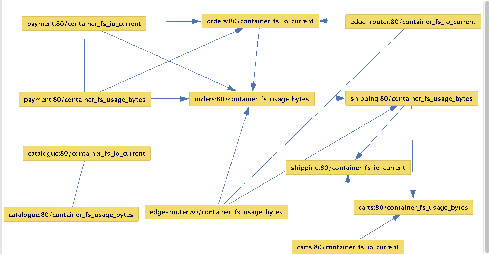
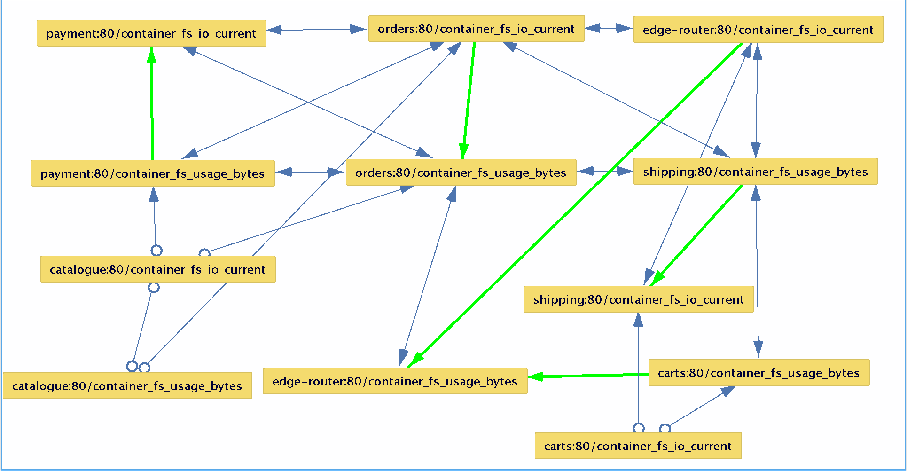
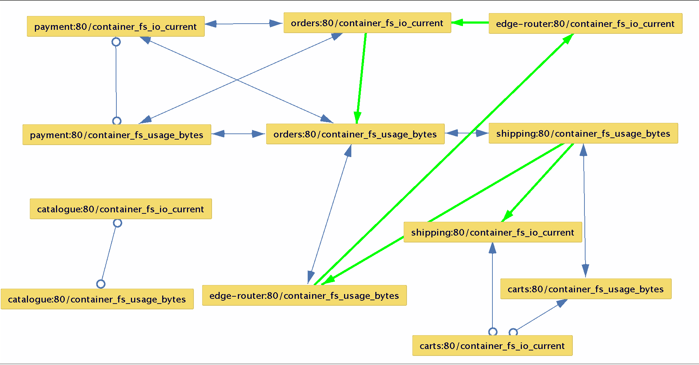
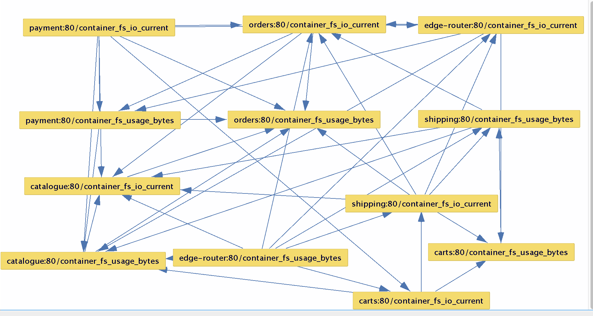
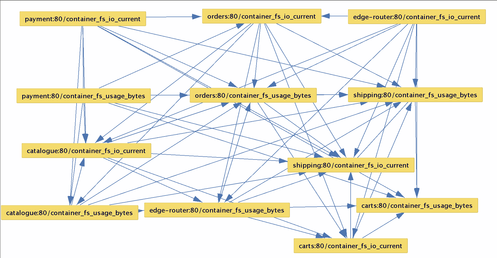
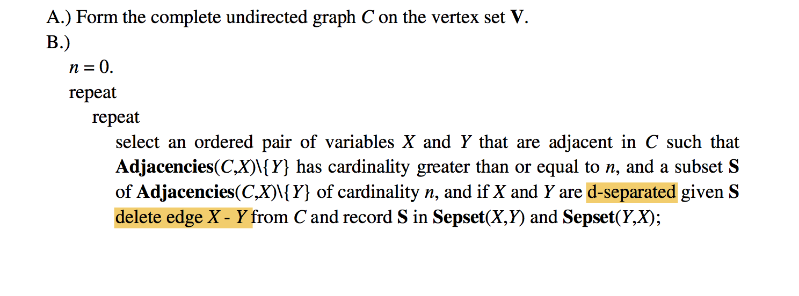
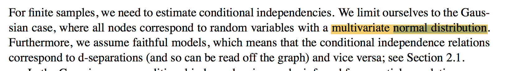
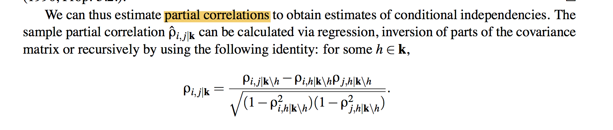

# 进度

### 1. 数据

#### 1.1 数据集概况

* 与殷博对接，有了初步的数据集：result.csv
* columns：212
* 存在的问题：
  * 数据量太大，无法直接搜索
  * 部分列值全为0
  * 存在大量null，Tetrad无法处理null值，与殷博讨论解决策略

#### 1.2 数据执行情况

* 预处理：
  * service_data.csv
  * 只抽取了服务层性能数据, 14列，其中2列数据均为0，舍去，留12列
  * null暂时填0代替
  * 总体来看，0与null占相当大一部分
* 执行结果


PC  + Correlation T Test or Fisher Z Test or Mutinomial Logestic RW Test



PC + SEM BIC Test




FCI + Fisher Z Test or Correlation T Test or Mutinomial Logestic RW Test




FCI + SEM BIC Test 




FGES + SEM BIC




FGES + Fisher Z Score




FCI 与PC在使用相同的test方法情况下，所得结果基本相同。

Mutinomial Logestic RW Test执行速度较慢，

其他Conditional Correlation Test 等执行速度过慢，无法得到结果


### 2.算法

#### 2.1 源码研究

影响图构建核心3步骤：

1. 构建无向完全图
2. 独立性检验并删除条件独立的边
3. 边的定向化


其中，步骤1可以忽略，步骤三有ruler1-4，在源码中有规范的实现：

```python
    # For all the combination of nodes i and j, apply the following
    # rules.
    for (i, j) in combinations(node_ids, 2):
        # Rule 1: Orient i-j into i->j whenever there is an arrow k->i
        # such that k and j are nonadjacent.
        #
        # Check if i-j.
        if _has_both_edges(dag, i, j):
            # Look all the predecessors of i.
            for k in dag.predecessors(i):
                # Skip if there is an arrow i->k.
                if dag.has_edge(i, k):
                    continue
                # Skip if k and j are adjacent.
                if _has_any_edge(dag, k, j):
                    continue
                # Make i-j into i->j
                _logger.debug('R1: remove edge (%s, %s)' % (j, i))
                dag.remove_edge(j, i)
                break
            pass

        # Rule 2: Orient i-j into i->j whenever there is a chain
        # i->k->j.
        #
        # Check if i-j.
        if _has_both_edges(dag, i, j):
            # Find nodes k where k is i->k.
            succs_i = set()
            for k in dag.successors(i):
                if not dag.has_edge(k, i):
                    succs_i.add(k)
                    pass
                pass
            # Find nodes j where j is k->j.
            preds_j = set()
            for k in dag.predecessors(j):
                if not dag.has_edge(j, k):
                    preds_j.add(k)
                    pass
                pass
            # Check if there is any node k where i->k->j.
            if len(succs_i & preds_j) > 0:
                # Make i-j into i->j
                _logger.debug('R2: remove edge (%s, %s)' % (j, i))
                dag.remove_edge(j, i)
                break
            pass

        # Rule 3: Orient i-j into i->j whenever there are two chains
        # i-k->j and i-l->j such that k and l are nonadjacent.
        #
        # Check if i-j.
        if _has_both_edges(dag, i, j):
            # Find nodes k where i-k.
            adj_i = set()
            for k in dag.successors(i):
                if dag.has_edge(k, i):
                    adj_i.add(k)
                    pass
                pass
            # For all the pairs of nodes in adj_i,
            for (k, l) in combinations(adj_i, 2):
                # Skip if k and l are adjacent.
                if _has_any_edge(dag, k, l):
                    continue
                # Skip if not k->j.
                if dag.has_edge(j, k) or (not dag.has_edge(k, j)):
                    continue
                # Skip if not l->j.
                if dag.has_edge(j, l) or (not dag.has_edge(l, j)):
                    continue
                # Make i-j into i->j.
                _logger.debug('R3: remove edge (%s, %s)' % (j, i))
                dag.remove_edge(j, i)
                break
            pass

        # Rule 4: Orient i-j into i->j whenever there are two chains
        # i-k->l and k->l->j such that k and j are nonadjacent.
        #
        # However, this rule is not necessary when the PC-algorithm
        # is used to estimate a DAG.
```

这部分完全根据图的结构特点进行定向化，不涉及矩阵数据。


独立性检验部分存在问题：

* Tetrad以及之前CloudRanger声称其算法实现基于《Causation, Prediction, and Search》，该书作者即为PC算法提出者。



书中却是明确说到用D分离进行条件独立检验，不过没有给出检验细节过程。

尝试写D分离过程，发现如下问题：

* D分离的运用对象是有向图DAG，而我们目的是从无向完全图，求得有向图，过程正好相反
* D分离过程需要概率分布函数，我们的数据仅有一个监控数据的矩阵。

基于上述原因，D分离似乎不能用到这里，进行条件独立判断


Python代码中用了G-square进行独立检验，但是导入除示例数据外的数据均报错。

源码中表示其算法参考文献：《Estimating High-Dimensional Directed Acyclic Graphs
with the PC-Algorithm》

察阅该文献，发现其给的例子并没真正用D分离，而是假设变量呈现

D-separation 算法又问题：

用于有向图（DAG）

文献：Estimating High-Dimensional Directed Acyclic Graphs with the PC-Algorithm

中假设了变量正态分布的条件



并且利用 partial correlations 求解概率分布




#### 2.2 代码分离

* 和殷博沟通解决Tetrad lib库中search算法的抽取工作

#### 2.3 其他策略

改团队提供了其他工具： https://github.com/bd2kccd

包括Python借口，web应用，以及API接口，JAVA CMD

这些工具实质上都是调用Java包，只是外层封装不同。


#### 3. 问题明确

* 算法选择
* 代码需要到什么程度，用API接口可行性


