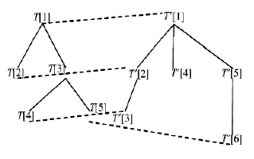

### 1. CloudRanger

​	该论文重点不在异常检测，而在于故障诊断，两个工作分开；

​	强调的优点：获得调用图的花费太高，因此该方法不需要调用图；

​	特点：把云原生系统当做黑箱、启发式、无监督；

​	步骤：Anomaly dection —> Impact graph construction —> Correlation calculation —> Root cause investigation

### 2. 一种基于执行轨迹监测的微服务故障诊断方法

步骤：

- 执行轨迹监测及构建（调用树）

- 故障诊断

  - 结构异常诊断

    树编辑距离 —> 树相似度 —> 异常程度过大则报错 —> 与相似度最大的基准轨迹进行匹配，定位异常位置

  - 性能异常诊断

    变异系数高则报错，对该轨迹进行性能分析 —> 执行轨迹转执行序列，构建请求处理矩阵  —> 对该矩阵进行主成分分析

​	

#### 2.1 执行轨迹监测及构建

##### 2.1.1 监测

调用树中每个节点（方法调用）有多个标识符:

$M_i$=(requestUID,	//请求标识符，确定方法调用所属请求  

​	methodUID,	//方法标识符

​	callerUID,	//父方法标识符，确定组件间的方法调用关系

​	calleeList,	//子方法列表

​	info) 		//其他信息

info=(callType,	//调用类型,分为本地调用和远程过程调用

​	serviceUID,	//方法所在服务组件的标识符

​	order,		//远程调用顺序（本地调用通过时序关系（子结点从左到右的排序）即可确定调用顺序 ），确定多服务组件方法调用顺序  

​	startTime,	//开始时间

​	endTime,	//结束时间

​	duration) 	//执行时间（不包括子方法执行时间）

用动态插桩的方式监测执行轨迹

##### 2.1.2 构建执行轨迹

- 以本地入口方法为根结点构建调用子树
- 根据requestUID将子树汇聚,并根据方法调用关系构建调用树

约定规则：

- 循环调用：结点 $M_1,M_2,...,M_n$ 有相同的方法标识,有相同的父结点; 
- 递归调用：结点 $M_1,M_2,...,M_n$ 有相同的方法标识,结点互为父子关系; 

若发现遗漏的新的正确执行轨迹$T_i$,可将其加入基准执行轨迹集合：

- 与集合 S 中已有的轨迹 $C_j$ 进行匹配(Bfs): 
  - 如果匹配成功,则继续下一个执行轨迹的匹配; 
  - 如果匹配失败,则集合S新增执行轨迹$T_i$;  

#### 2.2 故障诊断

##### 2.2.1 结构故障诊断 

###### 2.2.1.1 树编辑距离

定义：对于两棵树$ T_i 、 C_j$,通过增加、 删除和修改,将 $T_i $转换为$C_j$所需的最小代价（编辑次数）。

先找到它们之间的映射（相同的部分），再对不同的部分进行操作转换：

$T_i$中没有虚线连接的点是需要删除的点（设为υ），$C_j$中没有虚线连接的点是需要插入的点（设为ω）

M为$T_i$到$C_j$ 的一个映射，则映射代价为：

其中，λ为空结点，(υ→ω)为结点υ修改成ω的代价，(υ→λ)为删除结点υ的代价，(λ→ω)为增加结点ω的代价 

最小代价定理：$d(T_i,C_j)=min${cost(M)}	(证明过程：https://www.taodocs.com/p-85666696.html	   page4)

采用动态规划，先递归考虑子树的最小编辑距离，状态转移方程：

采用树编辑距离来评估执行轨迹的异常程度，即计算请求i的执行轨迹 $T_i$与每个基准执行轨迹 $C_j$的编辑距离。

##### 2.2.1.2 树相似度与异常程度

仅按照编辑距离不够确定轨迹 $T_i$与哪个基准轨迹最相近,因此定义树的相似度： 

树的相似度越低，异常程度越大，因此定义异常程度AD(abnormality degrees): $AD = 1-max(Sim(T_i,C_j))$

若AD>γ（预置的阈值 ），则报错，需要定位错误

##### 2.2.1.3 错误定位

采用Bfs将$T_i$ 与最相似的基准轨迹$C_j$ 进行匹配，若某方法的方法标识符不一致，则该位置出现了错误

#### 2.2.2 性能异常故障诊断  

##### 2.2.2.1 根据变异系数报错 

定义变异系数CV(coefficient of variation)：

    

​									其中$x_i$为第 i 个请求的执行时间 

若CV过高，则报错并进行性能分析

##### 2.2.2.2 主成分分析（PCA）

把请求的执行轨迹转为执行序列，构造m*n的请求矩阵，其中m为请求数量，n为执行轨迹的方法数量，$t_ij$ 为请求I的执行轨迹中调用方法j的时间。

对该n维数据进行主成分分析：

PCA的思想是将n维特征映射到k维上，这k维特征称为主成分，可有效降低原始数据的维度，从而减小解决问题的花费。

为了使数据从n维降到k维的损失尽可能小，需要进行以下步骤：

1. 中心化

   

得到中心化后的矩阵Z

2. 计算Z的协方差矩阵Σ  

   

3. 对Σ进行特征值分解，求解特征方程：$ΣX = λX$

   得到特征值$λ_1,λ_2,...,λ_n$ 及对应的特征向量$μ_1,μ_2,...,μ_n$

   

4. 选取主成分方差百分比最大的k个特征值对应的特征向量

   方差百分比：

   （β取0.85 ）

    

（推导过程：https://www.cnblogs.com/pinard/p/6239403.html）

##### 2.2.2.3 异常方法的定位

1. 对选取的k个主成分 $p_1,p_2,...,p_k$按照对应的特征值$λ_1,λ_2,...,λ_k$从大到小排序，排序越靠前则该主成分愈显著;

2. 依次选取主成分最大系数及对应的方法并计算方法的权重因子，得到k个方法及权重因子;

3. 对选取的k个方法按照权重因子进行倒序排序;

4. 针对每个方法计算在每个服务组件的平均执行时间，并且按照平均执行时间进行倒序排序;

5. 输出选取的 k 个方法及对应的在各个服务组件的执行时间，这k个方法调用即为引发性能异常的关键环节

   

    

### 3.MonitorRank

CloudRanger指出MonitorRank的缺点是：

- 需要精确调用图，这会造成大量花费
- 错误传很多错误传播路径不在调用图中（外部因素）

但我感觉似乎其实MonitorRank解决了诊断外部因素导致的不在调用图上的异常的问题...

#### 3.1 异常检测

检测算法输出检测到异常的前端传感器、相应的指标和时间。对于每个伪异常，要计算相应指标数据与其他所有传感器的数据的相似度。

#### 3.2 聚类

调用图不能可靠地表示依赖关系，两个传感器可能因为一些外部因素（硬件）而相关。如果$v_1,v_2$ 只因为$v_3$ 而相关，数据点应该聚集到椭圆形区域。但还有一些数据点聚集到了右下角长方形区域，这是因为一些外部因素。

因为传感器在短时间内不会从硬件上移动，因此可以对历史数据进行聚类，找出与一些可能因为外部因素而相关的传感器。该操作不需要实时执行。

#### 3.3 随机漫游算法

MonitorRank直接在调用图上进行随机漫游，类似于PageRank算法，最后输出与发现的异常最相关的传感器的排名。

