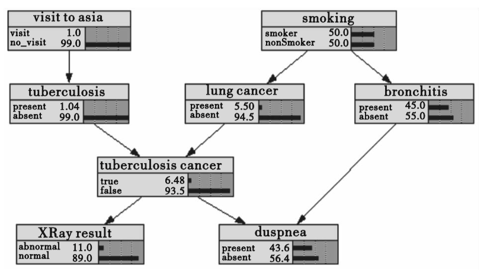
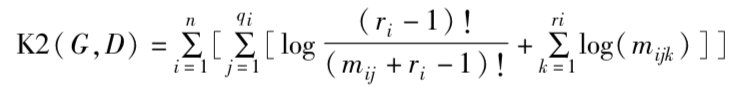
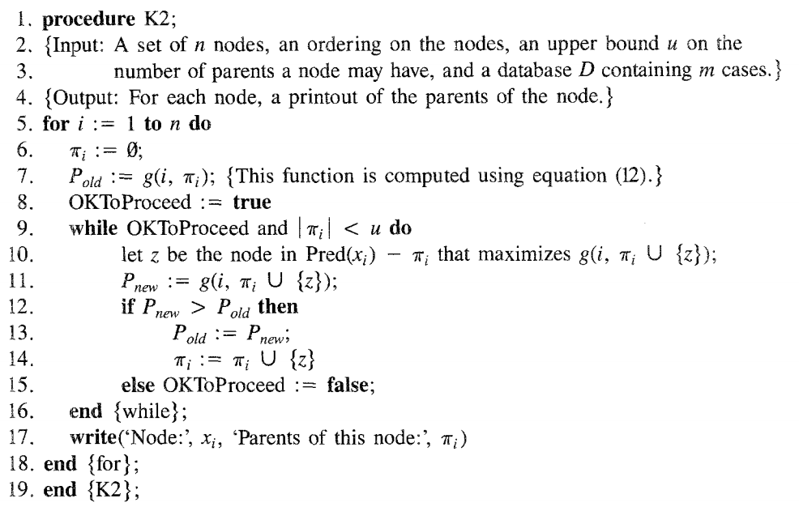

### 贝叶斯网络结构学习

#### 1. CloudRanger

重点：构建Impact graph

 Impact graph实际上就是贝叶斯网络

#### 2. 贝叶斯网络

由<X, A, Θ>三部分组成：

​<X, A> ：一个DAG

X：节点的集合，$X_i∈X$表示一个限制定义域的随机变量;

A：有向边的集合，$a_{ij}∈A$表示$X_i←X_j$，节点之间的直接依赖关系;

Θ：网络参数，$θ_i∈Θ$表示与节点$X_i$相关的条件概率分布函数。

贝叶斯网络条件独立性假设：给定一个节点的父节点集，该节点独立于它的所有非后代节点。所以：

$P(X_1，X_2，... ，X_n)=∏_{i=1}^n P(X_i|X_1，X_2，... ，X_{i-1})=∏_{i=1}^n P(X_i|π(X_i))  $ 

($i=1，2，...，n，π(X_i)$表示 Xi的父节点集)

结合Θ，一个贝叶斯网络可以唯一确定节点X的联合概率分布，由于节点间存在条件独立的性质，贝叶斯网络的计算效率远高于其他计算联合概率的方法。

### 3. 贝叶斯网络结构学习 

NP问题，n个节点构成的有向无环图个数：$f(n)=∑_{i=1}^n (-1)^{i+1}\frac{n!}{(n-1)!i!} f(n-i) $，指数级

#### 3.1 基于依赖统计分析 

通过计算节点间互信息和条件独立性来找出各个节点之间的关系 ，最终得到符合这种关系的网络结构。

SGS算法 [1]:

1. 对每个顶点对a, b，及不包含a, b的顶点子集S，如果存在S d-speration a, b，则转到下一对顶点，否则在a, b之间加一条无向边，然后转到下一对顶点，直到考虑完所有的对。
2. 对每个满足a, b、a, c、b, c都相邻三点对a, b, c，当且仅当所有包含b但不包含a, c的顶点子集S都d-speration a, b时，把a—b，b—c的边都指向b
3. 输出（2）中所有有向边

问题：SGS算法时间复杂度随网络中节点数的增长呈指数级增长

PC算法 (paper [2] An algorithm for fast recovery of sparse causal graphs) (CloudRanger中使用)：

稀疏网络中节点不需要高阶独立性检验

所以从0阶独立性检验到高阶独立性检验，对初始网络中节点之间的连接进行削减，可以有效的从稀疏模型中建立贝叶斯网络。

时间复杂度：$2(_n^k)∑_{i=0}^k(_i^{n-1})$

TPDA算法 [3]：

比PC算法更高的时间复杂度和准确度

1. Drafting，计算每对节点间的互信息，建立完全无向图；
2. Thickening，考虑每个点对，如果该点对不是d-speration，则把该点对加入边集；
3. Thinning，检察边集中的每个点对，如果该点对是d-speration，则移走这条边

paper [4] (Decomposition of search for v-structures in DAGs)提出贝叶斯网络的分解方法：

1. 计算每对节点的条件独立性，建立完全无向图
2. 然后找出网络中d-speration集合并分割初始网络结构，得到一些d-speration的网络结构
3. 搜索出d-speration网络结构中的v-structures

paper [5] (Decompositionofstruc turallearning aboutdirected acyclic graphs) 把paper[4]中的分解方法用于贝叶斯网络学习：

搜索网络结构中的v-structure，将一个网络结构划分为多个网络结构并分别进行学习，最后得出一个最优的网络结构。

paper [6] (Structural learning of chain graphs via decomposition) 

也是基于链图的分解的方法，没有认真看所以还不了解它的思路，不过它声称比其他基于分解的算法在效率方面有很大的提升。

- 优点：学习效率高，能获得全局最优解；
- 缺点：随着节点的增加算法时间复杂度复杂度增加很快；

#### 3.2 基于评分搜索 

启发式搜索出评分最高的网络结构，搜索算法和评分函数很大的影响时间复杂度和精确度。

##### 3.2.1 评分函数

给节点集X一个观测数据集 D，通过学习找出一个最匹配数据集D的网络结构G，评分函数需要表示此网络结构与真实网 络的匹配程度。

 G上的评分：$score(G，D)=score(G|D)score(D)$，而$score(D)$是一个固定值，所以目标为找到一个网络结构$G^*$使$score(G^*|D)$最大。

K2评分函数 paper [7] (A Bayesian method for the in duction of probabilistic networks from data)：

经过一系列推导得出：

##### 3.2.2 搜索函数

K2搜索算法 paper [7]：

改进：粒子群算法、遗传算法、人工蜂群算法、蚁群算法；

基于评分搜索的缺点：容易陷入局部最优解，而且结构空间的大小随节点的增加呈指数增加（空间复杂度）；

#### 3.3 基于混合搜索 

结合两者的长处，先利用依赖统计分析缩减网络结构空间的大小，然后利用评分搜索得出一个最优的网络结构。 

MMHC 最大最小爬山法(paper [8] The max-min hil climbing Bayesian network structure learning algorithm)：

1. 用MMPC(max-min parents and children)确定出每个节点的父节点和子节点集，从而构建出网络结构的框架;
2. 用K2搜索对已经得到的网络结构的框架进行搜索评分，得出最优的网络结构 

#### 3.4 数据不完备

