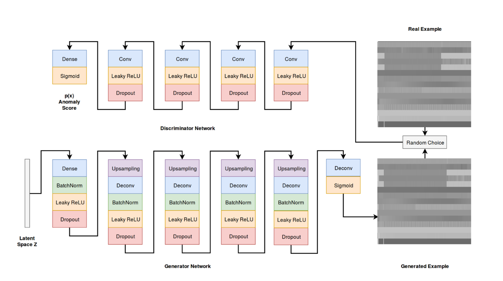
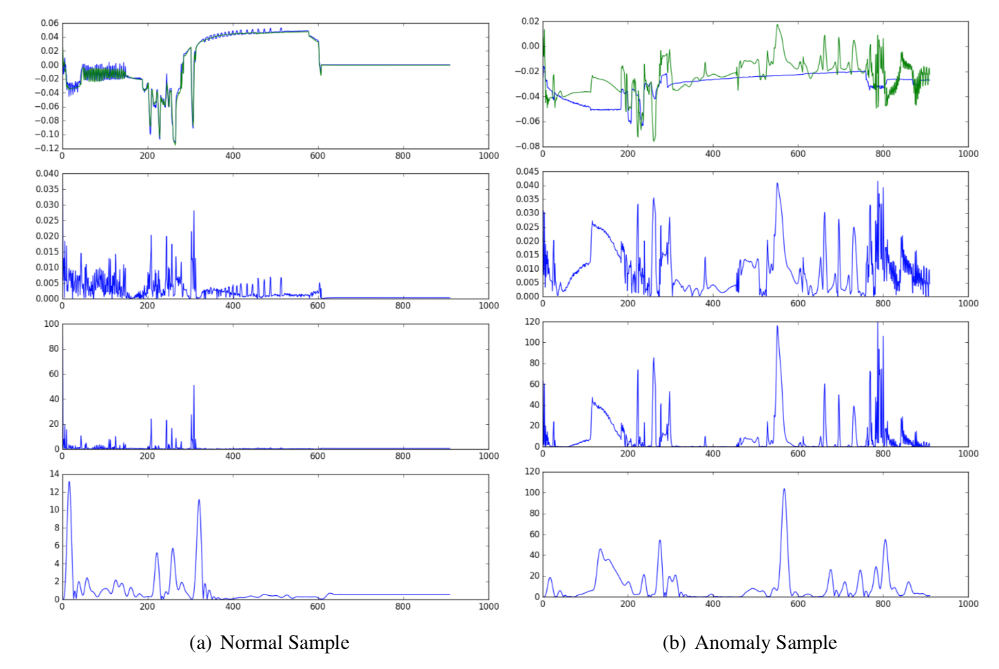

## Architecture and Experiments

### Intro

An autoencoder model as well as a GAN have been implemented for experiments on this task.

>  Thus resampling at a lower but fixed rate compared to the original data sequences will be a crucial part of preprocessing for detection of anomalies in full cycles.

### Data Preprocessing and Feature Selection

> 1. extensive preprocessing is required in order to transform the raw sensor data into a form that can be processed by a deep learning algorithm. 
> 2. However, the extracted features are desired to be as close to the raw sensor data as possible. This allows to reduce the amount of domain knowledge required for the anomaly detection task.

- decimation methods for sensor data
  - Reservoir-sampling and decimation by calculating mean values
  - Largest-Triangle-Three-Buckest(LTOB)
  - applying decimation filter

### Architecture Selection

> This makes it difficult to implement a binary classification model detect anomalies. Hence, a more reasonable approach is the training of a predictive model exclusively on normal data.

1. Autoencoder-based model

   Due to the lack of anomalous samples in the given dataset, a reconstruction method has been chosen over a significantly less complex classification method. A model for reconstruction allows to train the architecture exclusively on normal data.

2. GAN-based model

   

   <caption>Architecture of the generative adversarial model used for anomaly detection. The generator and discriminator are jointly trained in a minimax game. The discriminator is trained by feeding generated or real examples by random choice, in order to distinguish between real and fake data samples. The generator is trained to produce examples, which fool the discriminator into classifying them as normal data.</caption>

   The experiments in this thesis will be limited on training the GAN to generate normal samples and validate the capability of the discriminator to distinguish previously unseen normal sequences from anomaly examples.

### Experiments

**Autoencoder Experiments**

1. Measurement of score function
   $$
   \alpha^{(i)} = \frac{(e^{(i)}-\mu)^T}{\sum(e^{(i)} - \mu )}
   $$
   The scalar anomaly score a(i) can be interpreted as a normalized reconstruction error, given the deviation expected for normal data samples.

2. Teacher forcing & Scheduled Sampling

   avoid overfitting of auto encoder, however, it leads to significantly lower reconstruction quality during inference.

3. Experiment Results

   

   <caption>The upper graphs shows the original sequence (blue) and the reconstruction (green). The second upper graph shows the absolute difference between original and reconstruction, whereas the second lower graph shows the calculated anomaly score for the reconstructed sequence. Finally the lower graph shows the low-filtered anomaly signal, which was used to determine anomalous patterns.</caption>