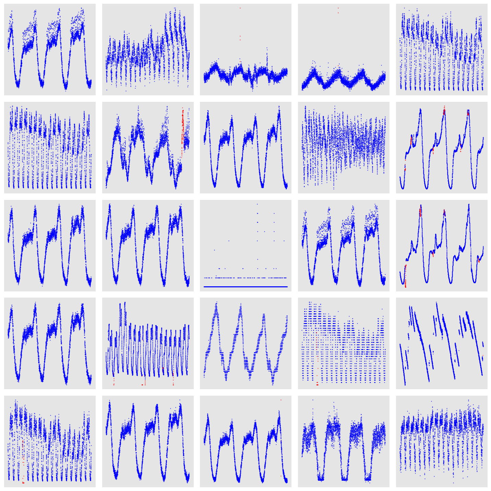

## Report

*Zehui Chen, Tao Sun, Yixuan Li*

This week, we have finished our work on testing a supervised learning way (Bi-LSTM Model) on KPI dataset and summarize the performance of our model. 

### 1. Bi-LSTM Neural Network Structure

The first three layers are bi-directional LSTM layers which enables our model to capture more information from time series by extracting valuable features through past and future series. Then we utilized a two layers of dense neural network to project these useful information into a one dimentional output which denotes for whether this point is anomaly or not. The exact struture of our model is sketched as follows:

```Python
_________________________________________________________________
Layer (type)                 Output Shape              Param #   
=================================================================
bidirectional_1 (Bidirection (None, None, 128)         40448     
_________________________________________________________________
dropout_1 (Dropout)          (None, None, 128)         0         
_________________________________________________________________
bidirectional_2 (Bidirection (None, None, 256)         263168    
_________________________________________________________________
dropout_2 (Dropout)          (None, None, 256)         0         
_________________________________________________________________
bidirectional_3 (Bidirection (None, 128)               164352    
_________________________________________________________________
dense_1 (Dense)              (None, 256)               33024     
_________________________________________________________________
dropout_3 (Dropout)          (None, 256)               0         
_________________________________________________________________
dense_2 (Dense)              (None, 1)                 257       
=================================================================
Total params: 501,249
Trainable params: 501,249
Non-trainable params: 0
_________________________________________________________________
```

### 2. Experiment

#### Dataset

We obtain 26 well-maintained business KPIs (where the time span is long enough for training and evaluation) from a large Internet company. The operators of the Internet company labeled all the anomalies in this dataset. Here is a visualization of this dataset:



<center>Figure 1: Visualization of KPI dataset (red denotes for anomaly points)</center>

#### Experiment Setup

The size of slide window is 30 (we would modify this value in the future to match settings on time delay evaluation phase). As mentioned in our previous reports, we computed 14 different features extracted from this long time series utilizing statistics methods. Instead of choosing these features manually through a strong feature enigneering way, we hope our model can select useful features automatically. Therefore, the final size of each data point is (30, 14). 

#### Performance Metrics

The algorithm evaluated in this report computes one anomaly score for each point. A threshold can be chosen to do the decision: if the score for a point is greater than the threshold, an alert should be triggered. In this way, anomaly detection is similar to a classification problem, and we may compute the accuracy, precision, recall and f1_score corresponding to each threshold. Defaultly, the threshold is set to be 0.5.

#### Overall Performance

We split API dataset into two parts: train set(85%) and test set(15%). The model trains on train set and is evaluated on test set. The corresponding peformance is shown in Table1.

| kpi_id           | acc    | f1_score | precision | recall | weight |
| ---------------- | ------ | -------- | --------- | ------ | ------ |
| 09513ae3e75778a3 | 0.9982 | 0.9429   | 1         | 0.9429 | 0.0521 |
| 769894baefea4e9e | 0.9994 | 0.9869   | 1         | 0.9869 | 0.0035 |
| 71595dd7171f4540 | 0.9925 | 0.7854   | 1         | 0.7854 | 0.0596 |
| 18fbb1d5a5dc099d | 0.9889 | 0.8835   | 0.9975    | 0.8505 | 0.0521 |
| 88cf3a776ba00e7c | 0.9533 | 0.2226   | 1         | 0.2226 | 0.0264 |
| a40b1df87e3f1c87 | 0.9976 | 0.9257   | 1         | 0.9257 | 0.0557 |
| 40e25005ff8992bd | 0.9936 | 0.8068   | 1         | 0.8068 | 0.0405 |
| 046ec29ddf80d62e | 0.9909 | 0.7441   | 1         | 0.7441 | 0.0035 |
| 9bd90500bfd11edb | 0.9987 | 0.9589   | 1         | 0.9589 | 0.0519 |
| 9ee5879409dccef9 | 0.9548 | 0.2226   | 1         | 0.2226 | 0.0264 |
| 8bef9af9a922e0b3 | 0.9954 | 0.8677   | 1         | 0.8677 | 0.0523 |
| 07927a9a18fa19ae | 0.9922 | 0.8341   | 1         | 0.8243 | 0.0044 |
| 1c35dbf57f55f5e4 | 0.9261 | 0.0809   | 1         | 0.0809 | 0.052  |
| c58bfcbacb2822d1 | 0.9991 | 0.9701   | 1         | 0.9701 | 0.052  |
| affb01ca2b4f0b45 | 0.9966 | 0.896    | 1         | 0.896  | 0.0596 |
| 02e99bd4f6cfb33f | 0.9169 | 0.0548   | 1         | 0.0548 | 0.0519 |
| 8a20c229e9860d0c | 1      | 1        | 1         | 1      | 0.0035 |
| a5bf5d65261d859a | 0.9997 | 0.9901   | 1         | 0.9901 | 0.052  |
| da403e4e3f87c9e0 | 0.997  | 0.9674   | 0.9828    | 0.9708 | 0.0521 |
| 7c189dd36f048a6c | 0.9978 | 0.9328   | 1         | 0.9328 | 0.0596 |
| 54e8a140f6237526 | 1      | 1        | 1         | 1      | 0.0033 |
| e0770391decc44ce | 0.9961 | 0.9234   | 1         | 0.9148 | 0.0594 |
| cff6d3c01e6a6bfa | 0.9931 | 0.8049   | 1         | 0.8049 | 0.0596 |
| 8c892e5525f3e491 | 0.9961 | 0.9092   | 1         | 0.9017 | 0.0594 |
| 76f4550c43334374 | 0.9909 | 0.7441   | 1         | 0.7441 | 0.0035 |
| b3b2e6d1a791d63a | 0.9976 | 0.9221   | 1         | 0.9221 | 0.0033 |

<center>Table1: Overall Performance of Bi-LSTM model on KPI dataset</center>

To compute the final score of our model, we compute the weighted average f1 score based on the length of each KPI data accounts for the whole data length (Column weight in Table 1). 
$$
final~score = \sum_{i=1}^{26}w_i~ f_1score(i)\\
= 0.7807
$$
