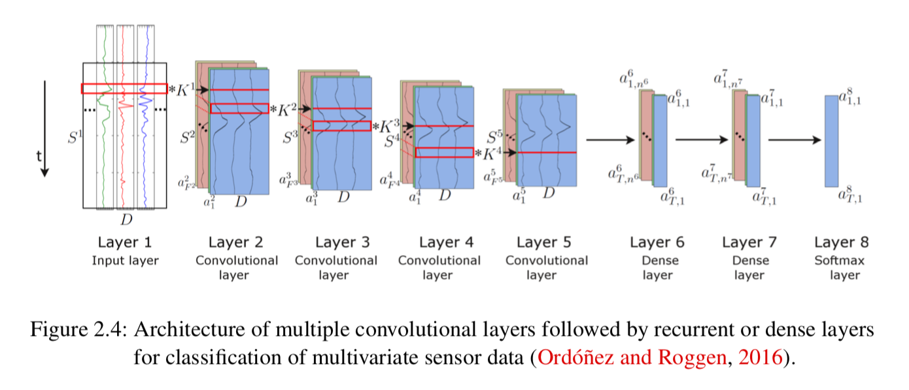

## Report for 10.20

### 1. Online Anomaly Detection on the Webscope S5 Dataset: A Comparative Study

In this paper, a relatively Simple Online Regression Anomaly Detector is proposed which is quite successful compared to other anomaly detection algorithm on Webscope S5 dataset. Since I mainly focus on algorithm in this project, most of my notes are related to algorithm implementation. 

- Methods

  - Feature Generation Using Sliding Windows(What we've already used in our works)

  - Offline Regression Anomaly Detection (Offline-RAD)

    

  - Specification for e-quantile removement

    

  - Online Regression Anomaly Detection(Online-RAD)

  

- Summary

  This paper proposed an algorithm that outperforms benchmarks by a large margin. The interesting thing is, at the begining of the paper, the author thinks most of anomaly detection algorithms lacks of robustness which means they can not achieve statistying performance on various dataset. They attempts to gives us an scalable and adaptive algorithm but end up with only testing it on Webscope S5 dataset. So how can I judge if this is algorithm is scalable and adaptive?

  Another problem is that the algorithm proposed in this paper is totally different from methods we will used in our future work. The former one mainly focus on traditional machine learning algorithm utilizing regression and density estimation, on the contrary, we want to develop an end-to-end, neural network based framework to solve this problem.

### 2. Deep Learning for Anomaly Detection

In general, the goal of machine learning approaches for anomaly detection is to model the distribution of normal data.

For unsupervised anomaly detection:

- Utilizing multivariate Gaussian distribution N(u, sigma) to model
- OC-SVM

The above two methods are unable to handle with temporal data due to inability  to capture time series information. Thus, deep learning based approaches are proposed and can be classified into 4 categories: 

- Classification Models
  - DTW(Dynamic time warping) + nearest neighbor
  - Convolutional LSTM architecture to extract features along the time axis and fed them into a recurrent layer 
- Forecasting Models
  - Classification models predict one or more nominal labels for a given input example, in this case a multidimensional sequence from several sensor channels. Instead, a machine learning model can also be trained to predict one or more continuous values, e.g. forecasting the next values for a given input sequence. Such a forecasting model can also be used for anomaly detection. (Not recommended )
- Autoencoder Models
  - How it works: The reconstructed sequences can subsequently be compared to the original input. The model is trained exclusively on normal data. Once the input sequence contains a patter, that is different from the normal data, the model is not able to reconstruct the sequence with equal quality compared to the reconstruction of normal data. Hence, an anomaly score can be calculated comparing the reconstruction with the original input.
