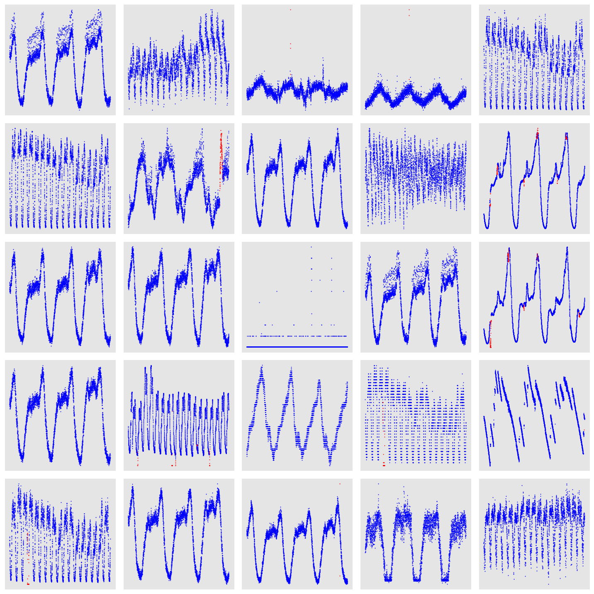
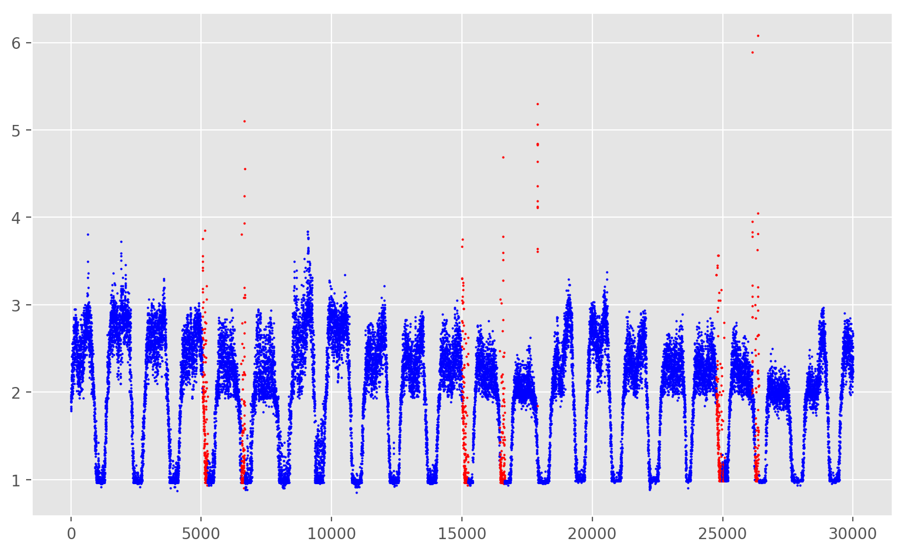

# Report

## Experiments

### Data Preprocessing

1. **Anomal Ratio**

```Python
# check the anomal ratio
print("anomal ratio is",np.sum(train_data['label'])/train_data.shape[0]*100, "%")

anomal ratio is 2.1604682764510974 %
```

2. **Data Shape**

```Python
train_data.shape
(2476315, 4)
test_data.shape
(2345211, 3)
```

### Data Exploration

1. **KPI ID** Different KPI ID denotes for different time series type. Hence, we may need to analysis each kind of KPI ID respectively. Here, I visualize 25 types of time series.

   

   From the above figures, we can conclude that different anomaly detection models should be developed based on each categorical KPI time series. Notes that there are 26 unique KPI IDs in train dataset but the inner number of categories may limit to 3.

2. **Specification for a KPI ID category**

   

   For this time series,  `T` equals to about 1500 timestamp, thus it's difficult to have a large time slot since `time_decay` limits to 7 timestamps. However, we may extract these kinds of time series features through LSTM. It can help us to capture some important series features .


### Feature Engineering

1. Related Works
   - **A Bag-of-Features Framework to Classify Time Series**, Mustafa Gokce Baydogan, George Runger, and Eugene Tuv
   - **Time-Series Classification with COTE: The Collective of Transformation-Based Ensembles**, Anthony Bagnall, Jason Lines, Jon Hills and Aaron Bostrom
   - **Time Series Feature Extraction**, Michele A. Trovero and Michael J. Leonard, SAS Institute Inc.
2. Current Works on feature engineering

   - Using MA model to get MA and MA diff
   - Computing EWMA(Exponential weighted moving average) feature
   - Computing Exponential 2rd smoothing feature
3. Other ideas
   - Utilizing BOF to generate more valuable features

